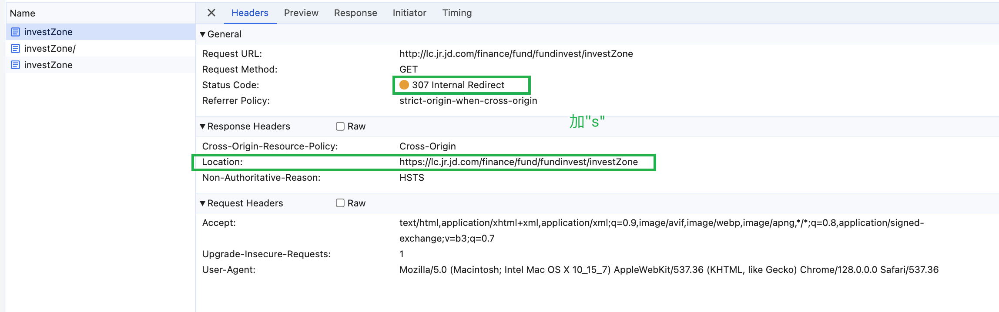
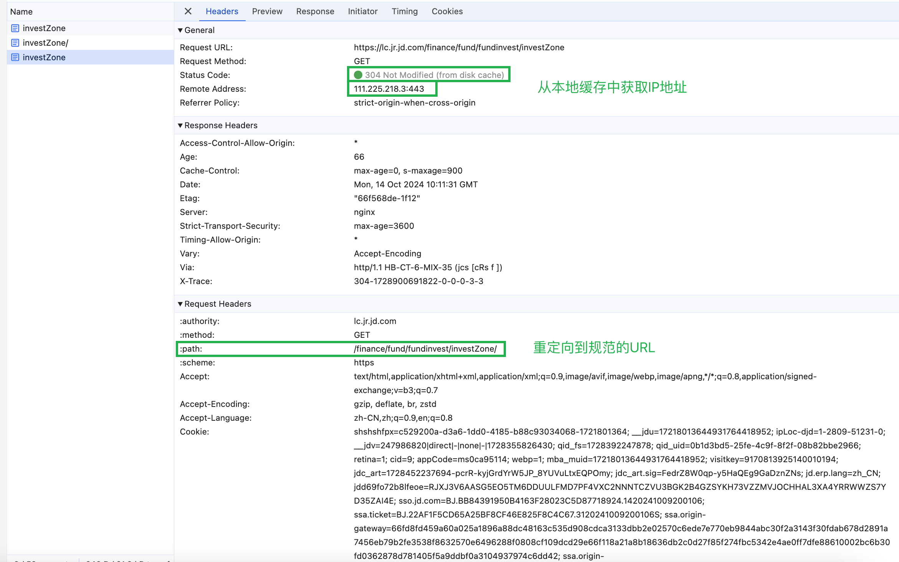
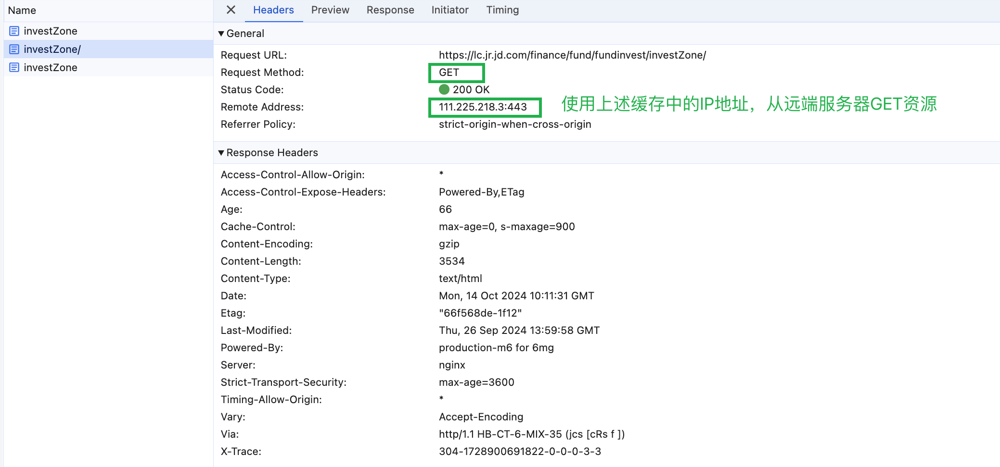
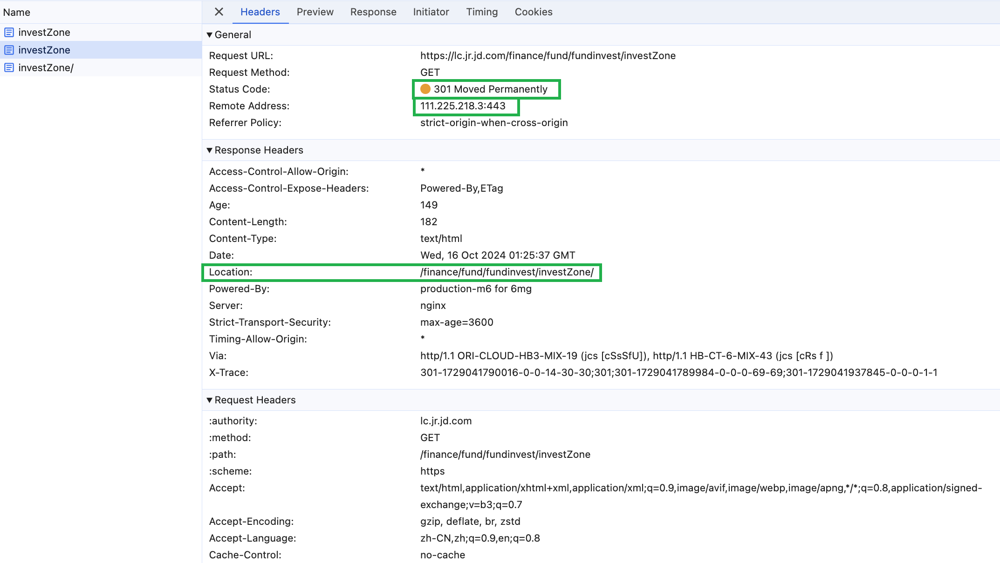
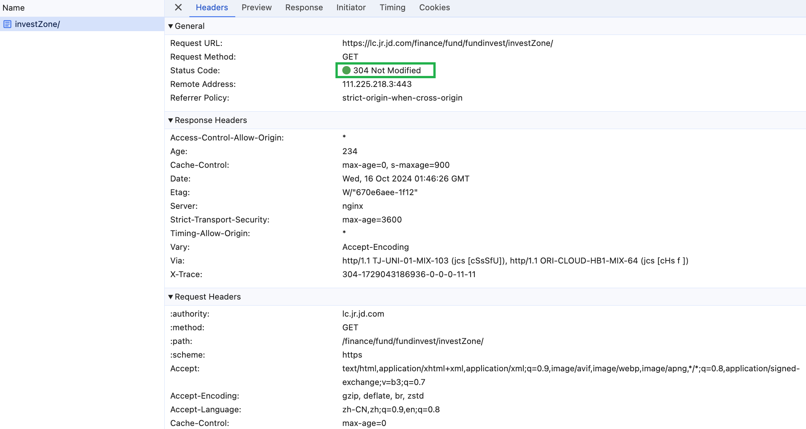

为了防止浏览器进行多次重定向，影响页面性能，投放链接应该以 https 开头，以 '/' 结尾
不用：`http://lc.jr.jd.com/finance/fund/fundinvest/investZone`
使用：`https://lc.jr.jd.com/finance/fund/fundinvest/investZone/`

## 不正确投放链接

访问`http://lc.jr.jd.com/finance/fund/fundinvest/investZone`的请求过程：

### 一、有缓存

#### 1. 协议变为 https

浏览器把协议从http替换为https（使用307重定向，保证不改变请求方法GET）

#### 2. 本地缓存获取IP

浏览器在本地缓存中获取到IP（远端地址）；重定向到补充末尾"/"的规范URL

- 返回304响应码，该GET请求的request header中包含（与缓存相关的）条件参数
- 使用path相对路径进行重定向，因为nginx在server中设置了`absolute_redirect off`

请求头中的条件参数（If-xxx）：

#### 3. 请求资源

浏览器使用上述请求从本地缓存中获取的IP，向远端服务器GET资源，并成功

### 二、无缓存

无缓存时，第2步变为使用301重定向

## 不正确投放链接

访问`https://lc.jr.jd.com/finance/fund/fundinvest/investZone/`的请求过程：

### 一、有缓存

服务器返回304响应码，表示可以使用客户端中之前缓存的副本

- 该请求的request header中包含「与缓存相关」的条件参数

### 二、无缓存

普通请求，响应码为200
