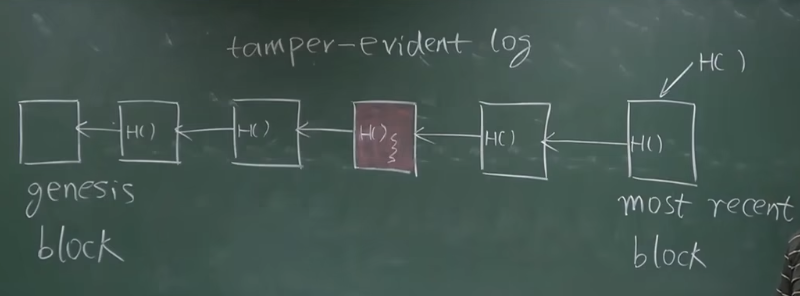
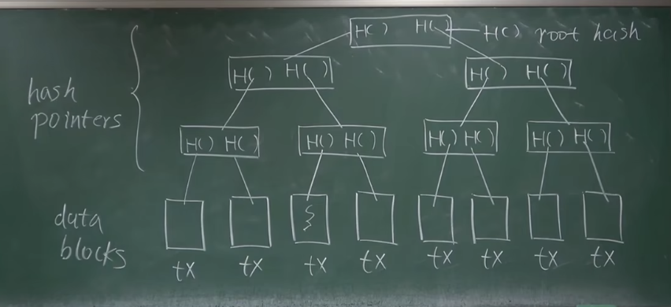
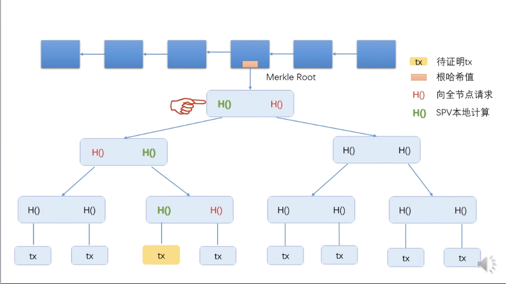

## 一、Hash Pointers（哈希指针）

哈希指针除了地址之外，还要保存地址的哈希值，用于检测结构体的内容是否被篡改

Block chain is a linked list using hash pointers.

区块链中的第一个区块叫 genesis block（创世区块），其 height（高度）为 0；最后一个区块叫 most recent block

后一个区块中的哈希指针是对前一区块的整体取哈希（包含前一区块中储存的哈希指针），可以实现 tamper-evident log（篡改证明记录）

修改一个区块，会导致其后所有区块的哈希发生改变。所以只需保存和比对最后一个哈希值，就能检测出对区块链中任何部位的修改

## 二、Merkle Tree（默克尔树）

Merkle tree 和 Binary tree 对比，就是把普通指针换成哈希指针

只要记录并比对 root hash（根哈希值），就能检测出整个树中任何部位的修改

### 区块结构

每个区块包含 block header（块头） 和 block body（块身）

1、块头：包含 该区块的所有交易组成的 Merkle tree 的根哈希值，但没有具体的交易内容
2、块体：包含具体的交易列表

### 比特币节点

比特币中的节点分为：

- full node, or fully validationg node（全节点）
- light node, or light-weight node（轻节点）

1、全节点：保存整个区块的内容，包括块头和块体（包含 tansaction list，即交易的具体信息）；会验证每一笔交易

2、轻节点：比如手机上的比特币钱包的APP，只保存块头；无法独立验证交易的合法性

Merkle proof 指从交易发生到根哈希值的路径，可以向轻节点证明某笔交易写入了区块链，流程如下：

（1）轻节点向全节点请求图3中红色的哈希值

（2）然后根据交易和红色的哈希值，自底向上算出绿色的哈希值，直至算出根哈希值

（3）最后将算出的根哈希值，与轻节点块头中的哈希指针比较，一致则证明该交易发生在此区块

上述方法也叫做 proof of membership 或 proof of inclusion
假设最底层的交易数为n，验证交易存在的时间复杂度为：θ(log(n))

对于无序的 Merkle tree，proof of non-membership（验证交易不存在）的时间复杂度为线性 θ(n)，即一个一个试
对于 Sorted Merkle tree（对交易取哈希，并且按哈希值大小排序），上述验证的时间复杂度为 θ(log(n))，与二分法一致：只需要对其大小相邻的两个交易进行哈希值的校验，如果和根哈希一致，则证明该交易不存在

由于区块链中不需要做不存在证明，所以比特币中的 Merkle tree 不要求排序

除了区块链 和 Merkle tree，哈希指针还可以用在其他无环的链表中
