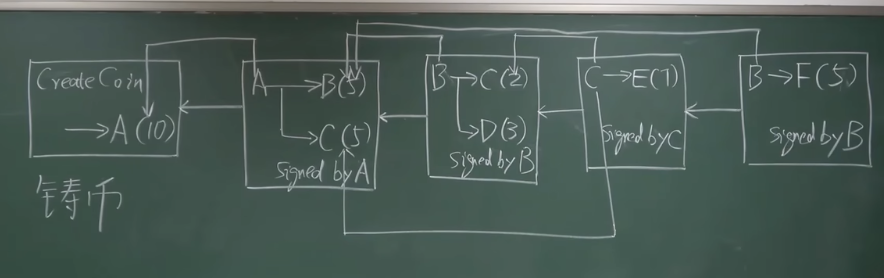
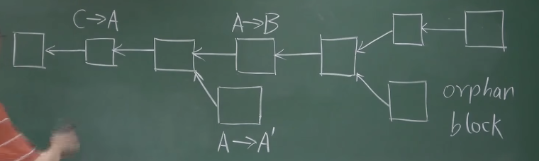

## 一、Double spending attack（双花攻击）

双花攻击指同一笔资金被重复支付的情况，也是数字货币面临的主要挑战

中心化解决方案：数字货币上添加唯一编号，并由央行维护一个数据结构，展示每个编号的货币由谁持有；如果付费方的货币在表中对应的持有人与此人不符，则证明该货币已支付给其他人

去中心化的解决方案：比特币

关注：货币的发行（挖矿）、交易的有效性验证（防范双花攻击）

## 二、交易的有效性验证

通过一个由所有用户共同维护的数据结构——区块链 来实现

## 三、区块链简易结构

Note：以下为简易版的区块链，每个区块都只有一个交易，实际上每个区块的交易记录都构成一个 Merkle tree

存在两种哈希指针：将区块串联成链表的指针，和指向前面某个交易的指针（为了说明币的来源，避免凭空捏造和重复交易）

1、用户A 具有发行货币的权利（铸币权，mint 铸币），并发行了10个比特币（coin base transaction，铸币交易）

2、用户A 分别给 用户B、用户C 5个比特币

3、用户B 分别给 用户C 2个比特币、用户D 3个比特币

4、用户C 转给 用户E 7个比特币

5、假设用户B 继续给 用户F 5个比特币，通过区块的回溯，校验出其已经在先前的交易中支付过了，所以交易不合法（避免双花攻击）

在 用户A 向 用户B 的交易中，需要记录 「输入」A的公钥、A的签名 和 「输出」B的地址（通过B的公钥取哈希等操作得到，可类比为银行卡账号）
A 需要 B的公钥 知道向哪里转账，所有节点都 需要 A的公钥 来验签

#### BitCoin Scripts

交易中的A的公钥（该交易的输入脚本），需要与 币的来源的A的公钥的哈希（前一交易的输出脚本） 相符（两脚本拼在一起能顺利执行）；否则说明币的来源有问题，A被冒名顶替了

## 四、区块结构

### 1、Block header

包含区块的宏信息，比如：version（协议版本）、hash of privious block header（前一区块头的哈希）、merkle root hash（Merkle树 根哈希），还有和挖矿相关的 target（挖矿的难度目标域值）、nonce（随机数）

Note：

（1）hash of privious block header 取的只是前一区块头的哈希，不包含块体

（2）Merkle树 根哈希 保证了块体中的交易列表不会被篡改

（3）target 满足 H(block header)≤target，块头中存的是该目标域值的编码 nBits（nBits 是用于表示难度的参数，用于判断区块头是否有效）

#### nBits

nBits 是一个包含了目标值信息的编码，通常以十六进制形式存储并表示为一个 4 字节（32 位）的数
该编码包含两个部分：
- 难度指数（Exponent）：前 1 个字节（8 位）
- 目标哈希的有效值（Coefficient）：后 3 个字节（24 位）
目标值越小，挖掘新区块的难度就越大。这允许系统灵活地调整挖矿的难度，并以压缩的方式存储信息

### 2、Block body

包含 transaction list（交易列表）

## 五、Distributed consensus（分布式共识）

账本的内容要取得分布式的共识

### 1、共识的例子：Distributed hash table（分布式哈希表）
达成共识的是 key-value pairs（键值对）

### 2、Impossibility result（不可能结论）

Example：FLP impossibility result
在 asynchronous system（异步系统）中，即使只有一个成员是 faulty（有故障的），那么也无法取得共识

CAP Theorem

（1）Consistency（一致性）

（2）Availability（可用性）：即使某些节点不可用，系统仍然能够提供服务

（3）Partition tolerance（分区容忍性）：分区是指在网络中，若干节点之间的通信链路发生故障时形成的网络割裂，这意味着某些节点无法与其他节点进行交互

不可能三角：任何一个分布式系统，只能满足以上两个性质，不可能三个性质都满足

### 3、分布式共识的著名协议：Paxos

该协议能保证一致性，但是有可能一直达不成共识（可能性比较小）

## 六、Consensus in BitCoin（比特币中的共识）

### 1、基于投票的共识方案

基于投票的方案需要确认投票权的 membership，比如联盟链的协议 hyperledger fabric（超分类账结构）。常规的投票方案会带来 sybil attack（女巫攻击），即通过超级计算机生成超半数的比特币账户以获取控制权

### 2、验证过程

H(block header) ≤ target，block header 中包含 4 bytes 的随机数 nonce，组装好区块后就开始尝试不同的 nonce，直到哈希值落在 target 内。如果某节点找到了符合要求的 nonce，即具备了记账权（在去中心化账本中写入/发布下一个区块的权利），发布后即由其他区块进行验证：

1、验证 block header 中的几项

2、看 block body 中的交易列表，验证每个交易都是合法的：（1）要有合法的签名；（2）以前没有被交易过

### 3、Forking attack（分叉攻击）

但是不同的链上可能发生重复交易（forking attack），解决方案是以 longest valid chain（最长合法链）为准，因此只有扩展最长合法链的区块才是合法的

当两个矿工同时创造新区块时，其他节点按照接收时间来选择接受哪个区块，等长的临时性的分叉会维持一段时间，直到其中一条链胜出（先找到下一个区块）；而另一条链就变成了 orphan block（孤儿区块） / stale block，被丢弃掉，也就没有出块奖励

### 4、Block reward（区/出块奖励）

获得记账权的节点，在发布的区块里可以进行 coinbase transaction（铸币交易），发布一定数量的比特币

一开始，每个发布的区块可以产生 50 BTC；21万个区块以后，出块奖励会减半为 25 BTC；再过21万个区块，会变成 12.5 BTC（现在）

平均出块时间为10分钟，出块奖励减半的时间：21w * 10min / (60min * 24h * 365d) ≈ 4年

### 5、基于 hash rate 的共识方案

Hash rate（计算 nonce 哈希的速度）决定了投票的权重，hash rate 越高，获得记账权并得到出块奖励的概率越大

避免 sybil attack（女巫攻击）：创建多个账户不会增加 hash rate，也不会增加投票权重

## 七、类比

挖矿：mining

比特币：digital gold

矿工（争夺记账权的节点）：minner
