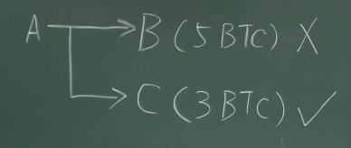
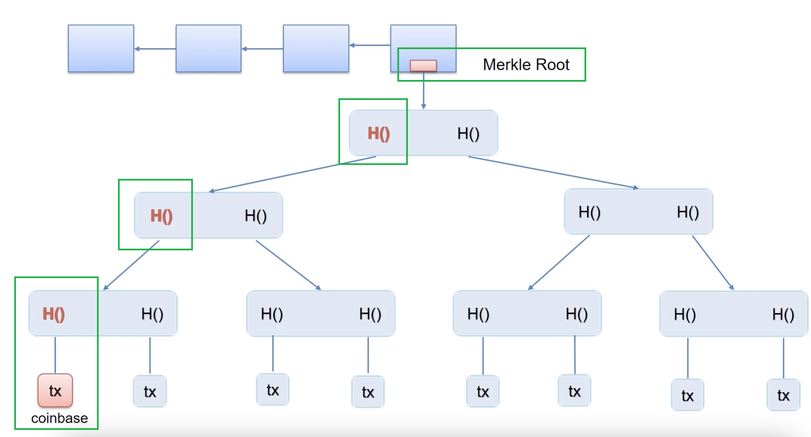
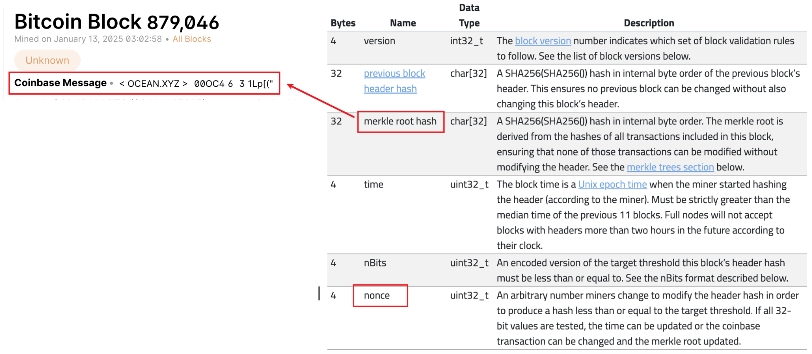
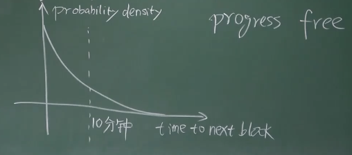
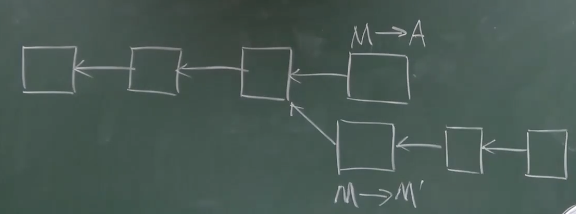
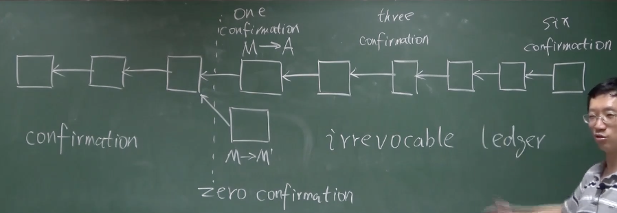

比特币采用 transaction-based ledger（基于交易的账本）模式，每个区块中记录交易信息（转账交易、铸币交易），系统上不记录交易信息

## 一、UTXO

比特币的全节点要维护一个数据结构 UTXO（Unspent Transaction Output，所有未被花出去的交易的输出 组成的集合）

一个交易可能有多个输出，即用户可以在一次交易中同时向多人转账（可以节省手续费）

比如：A 给 B 交易 5 BTC，B 将其交易出去；A 给 C 交易 3 BTC，但未交易出去。这是两个输出，但是只有 A 给 C 的交易在 UTXO 中



UTXO 中的每个元素要给出产生这个输出的交易的哈希值（可理解为交易的ID），以及它在这个交易里是第几个输出，这两个信息可以定位一个 UTXO 中的输出

### UTXO 的用途：

在交易发生前，检查即将花出去的币是否在 UTXO 中，在才是合法的，快速校验双花攻击和凭空捏造

每笔交易会消耗掉 UTXO 中的一些输出，同时在 UTXO 中产生新的输出，total inputs = total outputs（所有输入的金额 等于 所有输出的金额）

```
total inputs ≈ total outputs
    1 BTC         0.99 BTC
```

### Transaction fee（交易费）：

发布区块的节点（矿工）之所以会把他人的交易打包到新区块里，是因为 BTC 系统的第二个激励机制——交易费。通过把他人的交易打包到区块里，矿工会收取一些交易费（费用高的交易优先级就更高）

目前矿工挖矿、争夺记账权，主要目的还是为了获取出块奖励，但是随着出块奖励的减少；多年后，交易费可能会变成矿工的主要收益

## 二、Account-based ledger（基于账户的账本）

和比特币 transaction-based ledger（基于交易的账本）模式不同，以太坊采用 account-based ledger（基于账户的账本）模式，在这种模式中，系统需要显式地记录每个账户有多少币，查询更方便（不需要说明币的来源），但是隐私保护性不如比特币

## 三、Block Example

Block header 的详细字段：https://developer.bitcoin.org/reference/block_chain.html

其中，nonce 和 merkle root hash 是可以改变的，通过改变 coinbase message 来改变 merkle root hash（coinbase message 可以看做 extra nonce）



在比特币的 POW（Power of work，工作量证明机制）中，矿工需要不断尝试不同的 nonce 和 coinbase message 组合，以找到一个满足目标哈希值的区块头，共有两层循环：

外层循环调整 coin base 域 的 extra nonce，算出 block header 里的根哈希值之后，内层循环再调整 header 里的 nonce



在比特币系统中，验证交易的合法性，就是通过将交易的 input scripts 和 output scripts 配对后执行来完成的。注意：不是把同一个交易的输入脚本和输入脚本配对，而是把这个交易里的输入脚本 和 前一个提供币来源的交易里的输出脚本配对。如果拼接在一起可以顺利执行，那么该交易就是合法的

## 四、挖矿概率分析

Bernoulli trial（伯努利试验）：A random experiment with binary outcome，比如：掷硬币

Bernoulli process（伯努利过程）：A sequence of independent Bernoulli trials

Porsson process（泊松过程）：试验次数很多，成功概率很小

伯努利过程的性质之一是 memoryless（无记忆性）/ progress free（与过程无关）：前面的实验结果对后面的实验结果无影响。由于挖矿的成功概率很小，所以可以用泊松过程近似

出块时间服从 Exponential distribution（指数分布），纵轴是 probability density（概率密度），横轴是 time to next block（出块时间）。注意这是整个系统的出块时间，不是每个具体矿工的出块时间，具体到每一个矿工，出块时间取决于矿工的算力占系统总算力的百分比



如果不满足 progress free 这个性质，那么算力强的矿工会获得不成比例的优势，比如：A算力是B算力的10倍，但是A获得记账权的概率超过B的10倍。该性质正是挖矿公平性的保证

## 五、比特币的总量

产生的比特币数量构成一个 geometric series（几何序列）：21w * 50 + 21w * 25 + 21w* 12.5 + ... = 21w * 50 * (1 + 1/2 + 1/4 + ...) = 2100w

挖矿的过程对于维护比特币系统的安全性是至关重要的：Bitcoin is secured by mining，对于一个去中心化的系统，挖矿提供了一个凭借算力投票的有效手段，只要大部分算力掌握在诚实的节点手里，系统的安全性就能得到保证

## 六、比特币的安全性

### 1、偷币

偷币是不可能的，因为系统以最长链合法链为准，恶意节点产生的区块会变成孤儿区块被丢弃，并且恶意节点还会损失本应得的出块奖励

### 2、双花攻击

可以通过 forking attack（分叉攻击）实现。区块插入的位置在刚开始挖矿的时候就决定，因为设置的 block header 里需要填写前一个区块的哈希值。

分叉攻击：首先制造等长的合法链，比如，M 向 A 转账交易，产生了不可逆的外部效果（如购买实体商品）；然后再将该交易回滚，留下 M 向自己转账的区块，则 M 可从中不当获利



#### 如何防范分叉攻击？

多等几个区块 / confirmation（确认），M 向 A 转账的交易刚写入区块的时候，叫 one confirmation，后面的区块类推。比特币协议中缺省的设置是：等待 6 个 confirmation 之后，才认为前面的交易是不可篡改的（大约1小时）



区块链是 Irrevocable ledger（不可篡改的账本），这种不可篡改性只是一种概率上的保证，刚刚写入区块链的内容还是比较容易被改变的，随着后续 confirmation 的增加，被篡改的概率会指数级大幅度下降

Zero confirmation：转账交易发布出去了，但是还未被写入区块链中。这种方式在实际应用中比较普遍，因为（1）比特币协议缺省的设置是 节点接收最先听到的那个交易，所以上述例子中 M 转给自己的交易大概率不会被诚实的节点接受；（2）很多购物网站从支付成功到发货天然是有时间间隔的

### 3、恶意节点故意不把合法交易写入

因为总有诚实的节点愿意发布这些交易，所以合法交易总是可以被写到下一个区块里

在正常工作的情况下，也可能出现合法交易未被包含进去的情况，比如近期交易的数目太多。比特币协议中规定，每个区块的大小是有限制的，最多不能超过一兆字节，如果交易的数目太多，可能就只能等到下一个区块再发布

### Selfish mining（自私挖矿）

正常情况下，挖到一个区块就立即发布，防止别人发布后自己的区块作废、丧失出块奖励

Selfish mining：挖到多个区块，但是都藏着不发布，攒够6个之后同时发布。这种攻击的前提是，有恶意的节点需要占据很大一部分算力（比如至少51%）

Selfish mining 的好处：如果个人算力较强，可以减少挖后续区块的竞争
