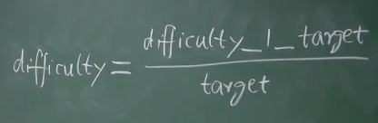

## 一、挖矿难度和目标域值

H(block header) ≤ target

调整挖矿难度，就是调整目标空间 在整个输出空间中所占的比例，通俗地说，就是哈希值的前面有多少 0

比特币使用的哈希算法是 SHA-256，整个输出空间是 2^256 个可能的取值

挖矿难度和目标域值成反比：

difficulty_1_target：挖矿难度等于1时，对应的目标域值（挖矿难度最小就是1），此时的目标域值很大

## 二、出块时间太短的后果

系统的总算力越强，安全性就越高，因为发动 51% attack（考虑2个分叉）的成本就更高

出块时间太短，但是传播速度较慢，很容易导致过多的 forking（分叉），系统的总算力就被分散了，更容易造成 forking attack，因为可以通过较小的算力（100%/分叉数+1%）实现攻击

以太坊的出块时间是15s，出块速度是比特币的40倍，因此以太坊设计了新的共识协议 ghost，其中产生的 orphan block 就不能简单的丢弃，而是要给一些奖励（uncle reward）

## 三、调整挖矿难度

比特币协议规定每个2016个区块，需要调整目标域值，`2016*10/(60*24)≈14天`

调整目标域值的公式：

其中，expected time（预期时间）是 2016*10，actual time（实际时间）是系统近期产生2016个区块所花费的时间。在实际代码中，上调和下调分别有4倍和1/4的限度

### 如何让所有的矿工同时调整域值？

block header 中存储的 nBits 是目标域值编码的版本（将 target 的256字节 压缩到4字节）。如果有矿工不调整，那么校验就不会被通过
