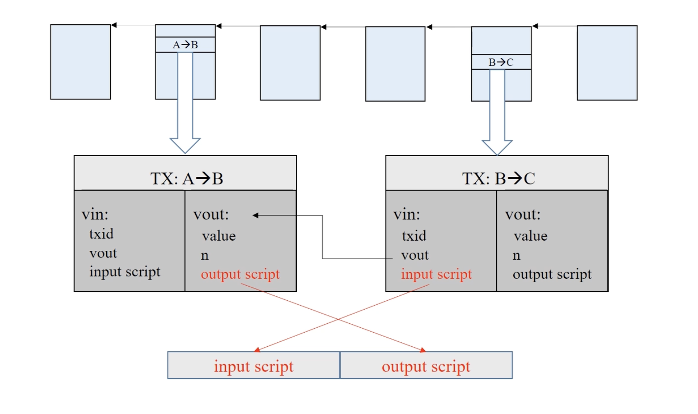

本节课较多用到 PPT 上的动画，视频链接如下：

`https://www.bilibili.com/video/BV1Vt411X7JF?spm_id_from=333.788.player.switch&vd_source=69ac93649ea21c4726fe85f272b6d968&p=9`

比特币使用的编程语言很简单，内存空间只有一个通用的堆栈


上述的输入脚本包含2个操作：分别把2个很长的数压入栈里

输出脚本有2行，分别对应上面的2个输出，每个输出有自己单独的脚本

# BTC 脚本校验方式

假设 A->B，B->C，下面对 B 交易时币的来源做校验，有两种校验方式



## 1、P2PK（Pay to Public Key）

```
input script:
    PUSHDATA(Sig)

output script:
    PUSHDATA(PubKey)
    CHECKSIG
```

1、PUSHDATA(Sig)：把 B 的签名入栈——来自输入脚本

2、PUSHDATA(PubKey)：把 B 的公钥入栈——来自输出脚本

3、CHECKSIG：弹出栈顶的两个元素（公钥和签名），用公钥验签，通过则返回 TRUE

## 2、P2PKH（Pay to Public Key Hash）——最常用

P2PKH 与 P2PK 的区别是：输出脚本给出的不是公钥，而是公钥的哈希值；输入脚本除了签名外，还需要给出公钥

```
input script:
    PUSHDATA(Sig)
    PUSHDATA(PubKey)

output script:
    DUP
    HASH160
    PUSHDATA(PubKeyHash)
    EQUALVERIFY
    CHECKSIG
```

1、PUSHDATA(Sig)：把 B 的签名入栈——来自输入脚本

2、PUSHDATA(PubKey)：把 B 的公钥入栈——来自输入脚本

3、DUP：把栈顶的元素复制一遍（即 B 的公钥）

4、HASH160：把栈顶元素弹出，并取哈希（即对 B 的公钥取哈希），然后把得到的哈希再压入栈

5、PUSHDATA(PubKeyHash)：把 B 的公钥哈希入栈——来自输出脚本

6、EQUALVERIFY 是弹出栈顶的两个元素（哈希值），并比较它们是否相等

7、CHECKSIG：弹出栈顶的两个元素（公钥和签名），用公钥验签，通过则返回 TRUE

## 3、P2SH（Pay to Script Hash）——最复杂

P2SH 的特点是 input script 要提供一个 redeem script（赎回脚本）

P2SH 常见的应用场景是对 multiple signature（多重签名，即一个输出要求多个签名才能把钱取出，目前已不推荐）的支持

验证分为两个阶段：第一阶段按照输入脚本和输出脚本的顺序执行；第二阶段执行赎回脚本

具体略，有点复杂，可简单理解为把 P2PKH 中的 PUSHDATA(PubKey) 和 CHECKSIG 提取成一个赎回脚本

## 4、Proof of Burn

```
output script:
    RETURN
        [Zero or more ops or text]
```

这种类型的输出被称为：Provably Unspendable（可证明不可花费） / Prunable Outputs（可删减输出）

这个脚本是证明销毁掉比特币的一种方法，有两种应用场景：（1）有些小的币种要求销毁一定数量的比特币才能够得到该币，这种币叫做 AltCoin（Alternative Coin）；（2）往区块链中写入一些内容，比如 digital commitment，把知识产权取哈希放在 return 后面，可以证明在某个时间点知道某个知识，任何用户都可以通过销毁少量比特币、换取向区块链写入的机会

注意：以上的 CHECKSIG 全称是 OP_CHECKSIG，DUP 全程是 OP_DUP
