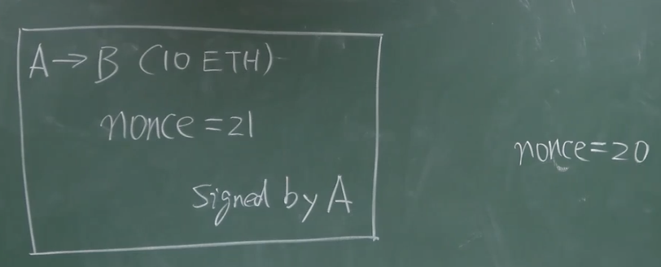

## 一、比特币——基于交易的账本

比特币用的是 transaction-based ledger（基于交易的账本），系统没有显示地记录账户的金额，需要通过 UTXO 计算，这种方式隐私性好，但不便于使用

## 二、以太坊——基于账户的账本

以太坊用的是 account-based ledger（基于账户的账本），转账时不需要说明币的来源

### 1、好处

不会出现 double spending attack（双花攻击——花钱的人不诚实）

### 2、缺点

需要预防 replay attack（重放攻击——收钱的人不诚实），一次交易被恶意节点广播多次

通过增加一个计数器 nonce，用来记录某账户交易的次数，转账时交易次数要成为交易内容的一部分，都受到发布交易者签名的保护；如果发起重放攻击，交易中 nonce 的值和计数器的值相等，会被校验为不合法（合法的应该比计数器大 1）

## 三、以太坊的账户类型

### 1、Extranally owned account（外部账户）

外部账户类似于比特币的账户，通过公私钥控制，也叫做普通账户。一个外部账户的状态有 balance（账户余额）和 nonce（计数器）

### 2、Smart contract account（合约账户）

合约账户不是通过公私钥对控制，不能主动发起交易（只有外部账户可以）。合约账户除了 balance（账户余额），nonce（计数器），还有 code（代码） 和 storage（状态/存储）

合约账户如何调用？创建合约时，会返回一个地址，知道合约的地址，就能调用合约，调用过程中状态会发生变化，但是代码是不变的

以太坊的创始人是 Vitalik。现在有人提出用智能合约生成一些 financial derivative（金融衍生品），比如：期权、期货
