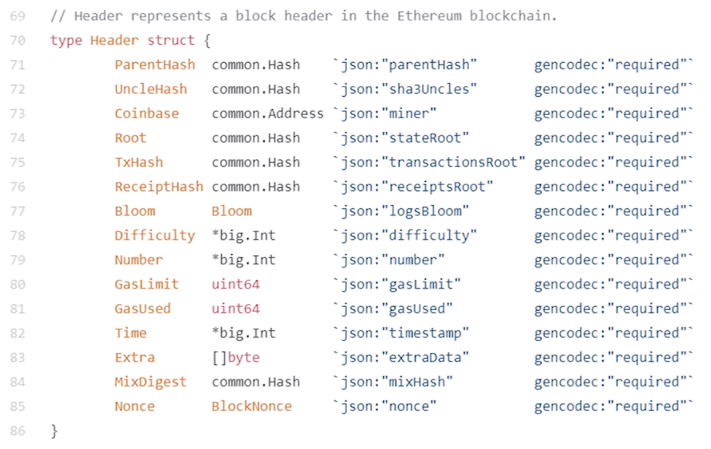

从账户地址到账户状态的映射：addr -> state

以太坊中的账户地址是 160 bits，也就是 20字节，一般表示为 40个 16进制的数；比特币和以太坊的地址格式、长度都不同，但是以太坊中的地址也是由公钥转换来的（公钥取哈希、进行截取，并只保留后面）

在比特币中，merkle tree 除了证明账户上有多少钱之外，还可以维护各个全节点之间状态的一致性

## 以太坊的状态树结构

以太坊采用的数据结构是 MPT（‌Merkle Patricia Tree，默克尔前缀树/压缩前缀树），基于 trie（单词查找树）

### 一、Trie 

#### 1、优点

（1）Trie 每个节点的分支数目，取决于 key 每个元素的取值范围，以太坊的 branching factor 是 17（0~f，加结束位）

（2）Trie 的查找效率取决于 key 的长度，越长查找次数越多，以太坊 key 值的长度都是 40

（3）比起 key-value 对，trie 不会出现哈希碰撞

（4）Trie 生成的树和插入顺序无关

（5）Trie 中的更新操作具有局部性

#### 2、缺点

一脉单传，存储浪费空间，于是就引入了 MPT

### 二、MPT

MPT 对树的高度进行压缩，访问内存的次数减少，提高效率。路径压缩在键值分布比较稀疏的情况下，效果比较好

以太坊中的地址是 160 bits，地址空间为 2^160，因此以太坊账户地址的键值分布非常稀疏。地址这么长的原因是防止哈希碰撞（不同公钥哈希后的值相同）

Merkle tree 比起 binary tree，把普通指针换成哈希指针；同样的，MPT 比起 PT，也是把普通指针换成哈希指针，最后计算出根哈希值

#### 1、根哈希值的作用

（1）防止篡改

（2）merkle proof，证明账户余额

（3）和 sorted merkle tree 一样，可以证明账户是否存在

#### 2、Modified MPT

以太坊用的是 modified MPT

以太坊之所以会保留历史状态，是为了便于回滚

### 三、状态树的数据结构

### 四、状态树中的状态

状态树中保存的是 (key, value)，value（账户的状态）是通过 RLP（Recursive Length Prefix，递归长度前缀，特点是极简）序列化之后存储在账户中的

Protobuf（protocol buffer）是一个做数据序列化的常用库，只支持一种类型：nested array of bytes（嵌套字节数组）

以太坊中的所有其它类型（整数、哈希），最终都要变成嵌套字节数组，实现 RLP 比嵌套字节数组容易很多
