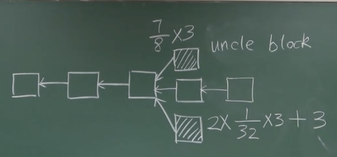
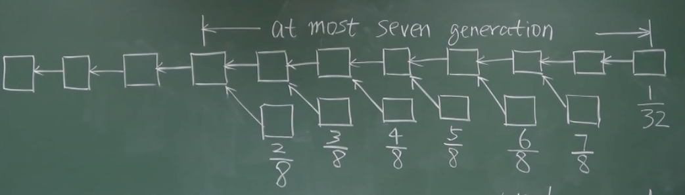
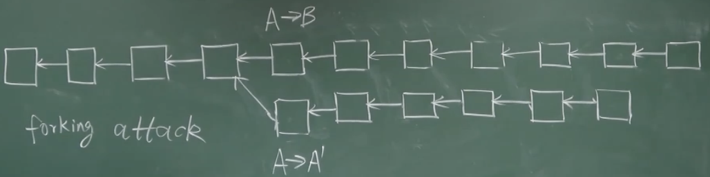

以太坊出块时间的显著降低，使得更容易出现分叉（甚至多个分叉），大型矿池有优势，尤其对个体矿工不公平

因为当出现分叉时，所有个体矿工的算力是分散的，而矿池中的所有算力会集中在其挖出的区块，导致矿池挖出的区块更容易成为最长合法链，造成 mining centralization，这种情况也叫做 centralization bias（中心化带来的不成比例的优势）；再加上矿池会在网络的多个地方有接口，所以其发布的区块可能更早被其他节点收到

## 一、叔父区块

GHOST 协议不是以太坊发明的，是以太坊对其做了改进。核心思想是给予孤儿区块（在以太坊中叫做 uncle block，叔父区块）一定的奖励（7/8 的出块奖励），而打包叔父区块的区块可以获得额外的 1/32 的出块奖励（一个区块最多包含 2 个叔父区块）

以太坊一开始的出块奖励是 5个以太币，后来改为 3个以太币，现在变为 2个以太币（和挖矿难度相关）

GHOST 的这种设计有利于鼓励系统中出现分叉后及时进行合并（解决系统中的临时性分叉）

但是可能存在矿池恶意竞争，故意不包含叔父区块

## 二、Uncle reward（叔父区块的奖励）

最长合法链上的后续区块，仍然能包含前面区块未打包的叔父区块，但是叔父区块距离越远，奖励越小（7/8, 6/8, 5/8, 4/8, 3/8, 2/8），最长不能超过六代

叔父区块的定义：必须和当前区块在七代以内有共同的祖先（at most seven generations）

设计七代以内辈分的原因是：如果不限制备份，全节点需要维护的状态就太多了；七代以内辈分 uncle reward 逐级递减的原因是：有利于鼓励出现分叉后尽早进行合并

在比特币和以太坊中，把 block reward 叫做 static reward（静态奖励）

在比特币中，tx fee 叫做 dynamic reward（动态奖励）；而在以太坊中，在执行区块中包含的智能合约时，可以得到 gas fee（汽油费），叔父区块是得不到汽油费的

比特币被比喻为数字黄金，是用来储值的；以太币被比喻为石油，是用来消耗的（不太恰当，因为以太币本身不会消失）

打包叔父区块时不应该执行叔父区块中的交易，因为叔父区块中可能存在有冲突的交易（执行完父区块的交易，再执行叔父区块的交易就会非法）；而是会通过 block header 检查叔父区块是不是一个合法发布的区块（是否符合挖矿难度要求）

叔父区块后面的节点不能给予奖励，否则分叉攻击就变得太简单了：如果成功，可以回滚交易；不成功，也可以合并获得 uncle reward

