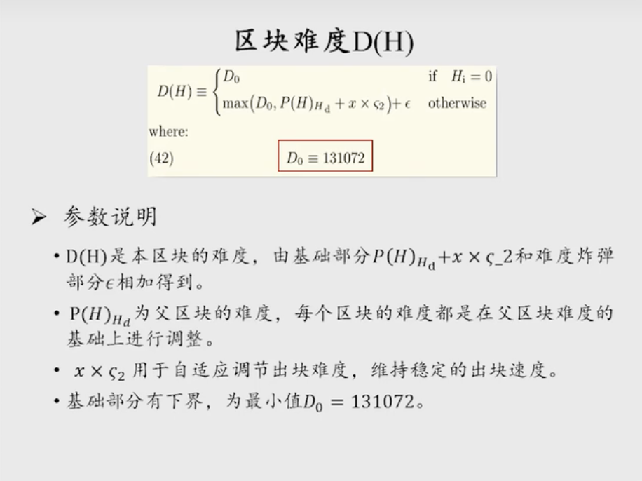
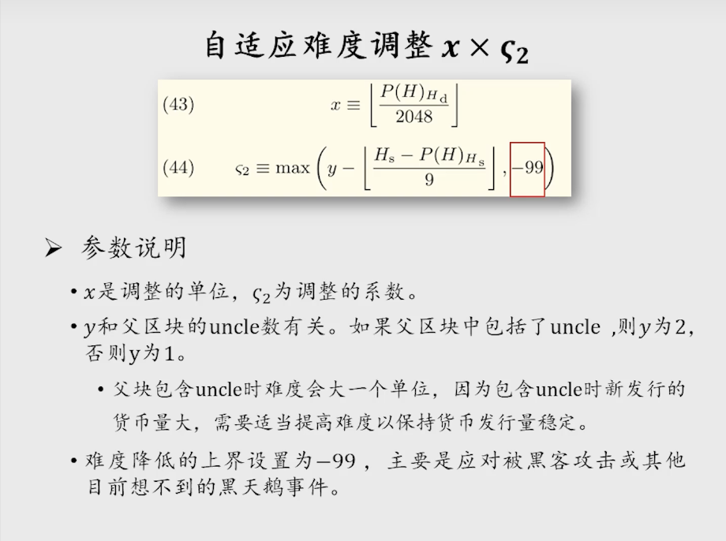
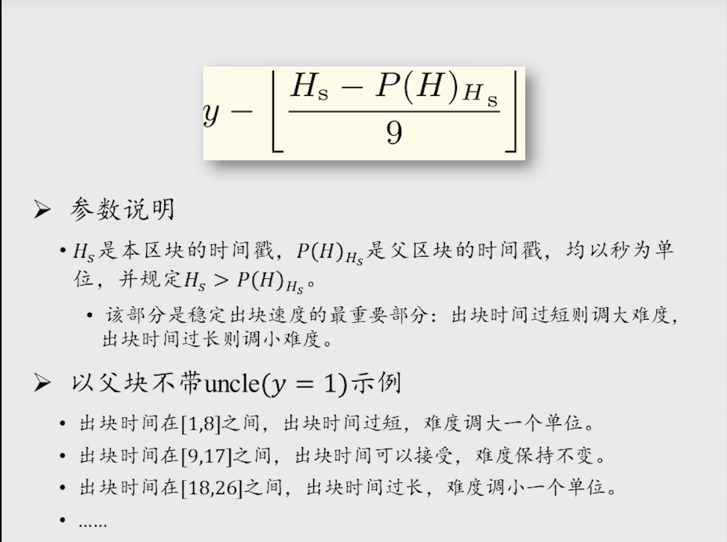
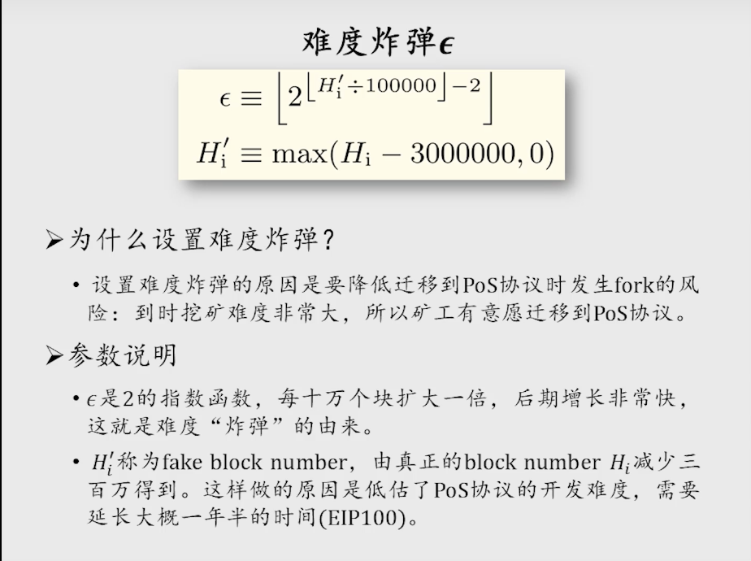
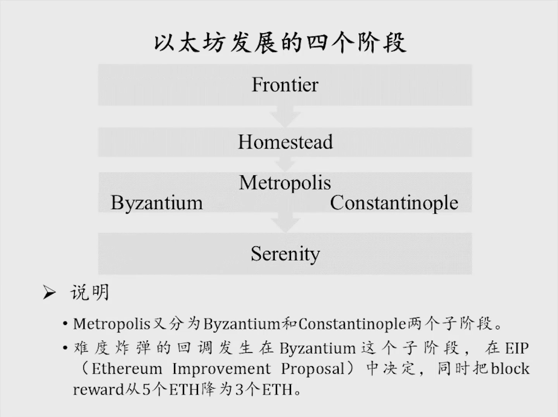

比特币是每隔 2016 个区块会调整挖矿难度，目标是维持出块时间在十分钟左右；以太坊是每个区块都可以修改挖矿难度

## 一、难度调整公式

基础部分的作用是维持出块时间在 15秒 左右

ε 是难度炸弹，为了以太坊从 POW 逐步过渡到 POS

### 1、基础部分

x 是难度调整的力度，为父区块的难度除以 2048，再向下取整

一次性下调难度最多是父区块难度的 99/2048

### 2、难度炸弹

## 二、以太坊发展的四个阶段

Frontier（前沿）、Homestead（家园）、Metropolis（大都会）和 Serenity（宁静）

其中 Metropolis 分为 两个子阶段：Byzantium（拜占庭） 和 Constantinople（君士坦丁堡），难度炸弹的回调发生在 Byzantium 阶段

Serenity（宁静）即以太坊2.0，从 POW 转向 POS

EIP（Ethereum Improvement Proposal）：以太坊改进提案

BitCoin Improvement Proposal）：比特币改进提案

## 三、具体代码实现

略，没特别明白，可以参考课程视频（20分）：

https://www.bilibili.com/video/BV1Vt411X7JF?spm_id_from=333.788.player.switch&vd_source=69ac93649ea21c4726fe85f272b6d968&p=20

比特币中讲过最长合法链，而对于以太坊来说是最难合法链
