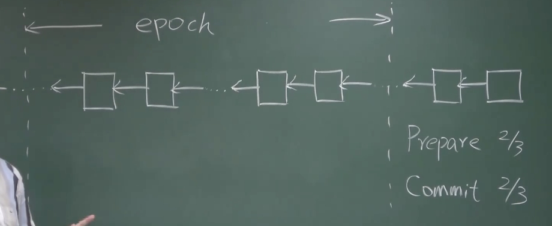
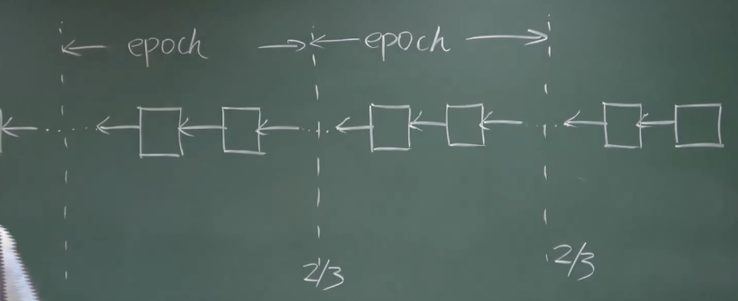

POW（Proof of work，工作量证明）受到的普遍批评是浪费电

以太坊交易的能耗比比特币低，是因为出块时间更短

## 一、POS 基本思想

POS（Proof of Stake，权益证明）的基本思想是：按照每个人投入资金的多少来决定收益的分配，这也叫做 virtual mining（虚拟挖矿）

采用权益证明的货币，在发行前一般会预留一部分货币给开发者，也会出售一部分货币来换取开发所需的资金。将来按照的权益证明的共识机制，按照每个人持有货币的数量进行投票

## 二、POS 的好处

（1）省去了挖矿的过程，也避免了由此带来的能耗和对环境的影响

（2）如果有人想发动恶意攻击，需要设法获得该币种一半以上的份额，即发动攻击的资源只能从加密系统内部获得，形成一个闭环。如果有人在初期大量买入，币价大涨，早期投资者可能会跑卖出路（类似于股份制公司遭受恶意收购）

基于 POW 的共识系统，从某种意义上来说，维护区块链安全的资源不是一个闭环，因为 Block chain is secured by mining. 而 mining 所需的 equipment 是由法币买来的（即加密货币的生态系统之外得到的），这就带来一个问题：虽然加密货币的总市值有了很大的增长，但是和世界经济总量相比仍然是微乎其微的，也就是说发动 51% attack 攻击的资源可以从外界得到、并且是有可能达到的，尤其对于刚发行的小的币种 AltCoin（Alternative coin），这叫做 AltCoin Infanticide（杀婴）

有些加密货币采用的是一种混合模型，即仍然需要挖矿，但是挖矿难度和占有权益（持有币的数量）相关。这样会导致，系统中持有币数量最多的人，每次挖矿都最容易，所以有些加密货币要求，投入的币会被锁定一段时间，不能重复使用（比如：挖矿时投入一些币降低挖矿难度，等区块发布出来后，投入的币就会被锁定一段时间，下次再挖就不能用了，过一定区块才能继续用），这叫做 Proof of Deposit（存款证明）

## 三、早期 POS 遭遇的问题

Nothing at stake（两边下注）：参与者通过持有并锁定一定数量的加密货币、而不需要消耗资源（如算力）来生成区块，因此可以同时支持多个分叉上的区块而没有损失

## 四、Casper 协议

Casper 是以太坊采用的 POS 协议

Casper the Friendly Finality Gadget（CFG，Casper 友好的最终性工具）：在过渡阶段，需要和工作量证明混合使用，为工作量证明提供 finality，它是一种最终的状态，包含在其中的交易不会被取消

单纯基于挖矿的交易时可能被回滚的，比如某个交易被写入区块链里，但是有人从前面的区块开始分叉，挖出一条更长的分叉链

Casper 引入了 validator（验证者）的概念，validator 必须投入一定数量的以太币作为保证金，保证金会被锁定。Validator 的作用是推动系统达成共识，投票决定哪条链是最长合法链，投票权重取决于保证金的数目大小

具体做法类似于数据库中的 two-phase commit（两阶段提交），第一阶段是 prepare message，第二阶段是 commit message

每挖出 100个 区块，就作为一个 epoch（纪元），要决定其能否成为 finality 需要进行投票，Casper 规定每一轮投票都要得到 2/3 以上验证者（按照保证金金额大小）同意才能通过

实际系统中不区分 prepare message 和 commit message，而且把 epoch 从原来的 100个 区块，减少到了 50个 区块就作为一个 epoch，每个 epoch 只需要一轮投票，投票结果对于上一个区块是 commit message，对于下一个区块是 prepare message，需要连续两轮投票（2个 epoch）都得到 2/3 以上的通过，才算有效

验证者参与该过程的好处是，如果其履行职责，可以得到相应的奖励；相反，如果验证者有不良行为被发现，会受到相应的处罚，比如：该投票时不投票，导致系统迟迟无法达成共识，这种情况会扣除其一部分保证金；比如乱投票，给两个有冲突的分叉都投票（两边下注），这种情况会没收其所有保证金（所有扣除或没收都是销毁的模式）

每个验证者有一定的任期，任期满后会有一个等待期，该等待期是为了让其他节点检举或揭发其是否有不良行为。如果等待期过了，验证者就可以取回当初的保证金和应得的奖励

## 五、关于 Casper 的思考

Casper 在挖矿的过程中，对其状态做一个 check point（检查点），这是否安全；或者说通过验证者投票达成的 finality 是否可能被推翻？

假设某个有恶意的组织想发动攻击，如果组织仅仅是矿工，那么就无法推翻已经达成的 finality，因为它是验证者投票的结果；如果组织是验证者，由于需要连续两轮投票都得到 2/3 以上的通过才算有效，那么至少有 1/3 的验证者两边下注了：正常链得到至少 2/3 的票数，非法链也得到至少 2/3 的票数，那么至少一共是 2/3+2/3=4/3 的票数，即至少 4/3-1=1/3 的验证者都参与了两条链的投票。这 1/3 的验证者被发现后，会被没收所有的保证金

EOS 加密货币（俗称柚子），采用的是 DPOS（Delegated Proof of Stake）协议，先用投票的方式选出 21个 超级节点，再由这些超级节点产生区块，现在已经凉了

## 六、POW 的争论

很多人认为 POW 挖矿的好处是，提供了把多余电能转化为钱的一种手段，可以有效地化解过剩产能，带动当地经济的发展。因为电能是很难存储、很难传输的，很多大型数据中心要建在电比较便宜的地方，就是因为传输数据比传输电容易，很多比特币的矿场都是建在电力资源丰富的地方
