## 一、智能合约概念

Smart contract（智能合约）是运行在区块链上的一段代码，代码的逻辑定义了合约的内容

智能合约的账户保存了合约当前的运行状态
- balance 当前余额
- nonce 交易次数
- code 合约代码
- storage 存储，数据结构是一颗 MPT

Sodility 是智能合约最常用的语言，语法上与 JavaScript 很接近

## 二、Sodility 数据结构

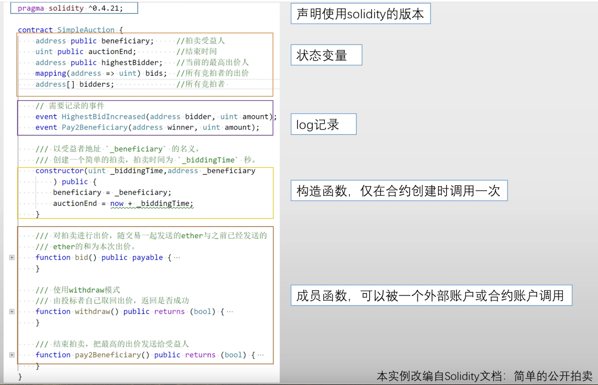

其中，bid() 后面的 payable 说明该合约账户能接受外部转账。该函数是用来进行竞拍出价的，在出价时需要把以太币发送并存储到合约里，锁定到拍卖结束，因此该函数需要有能接受外部转账的能力

withdraw() 函数是在拍卖结束后，未中标的账户可调用该函数，把出价时锁定在智能合约中的以太币取回来

## 三、智能合约调用

### 1、一个账户调用一个智能合约

外部账户调用智能合约，和转账类似：假设 A 发起一个交易转账给 B，如果 B 是普通用户，则为普通交易；如果 B 是合约账户，那么该调用实际是对 B 合约的调用，具体调用函数是在 data 域中进行说明

### 2、一个合约调用另一个合约

以太坊中规定，一个交易只有外部账户才能发起，一个合约账户不能主动发起交易。所以在实际中，有两种调用方式

#### （1）直接调用

通过一个普通账户调用合约 B 中的函数，然后这个函数再调用合约 A 中的函数

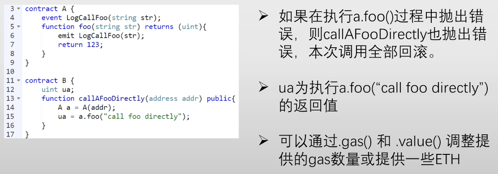

#### （2）使用 address 类型的 call() 函数

这种调用和上述不同的是：对于错误处理的不同。在直接调用中，如果被调用的合约执行发生错误，会导致发起调用的合约也跟着一起回滚；而 addr.call() 的方法，如果被调用的合约发生异常，addr.call() 会返回 flase，但发起调用的合约不会抛出异常，而是会继续执行

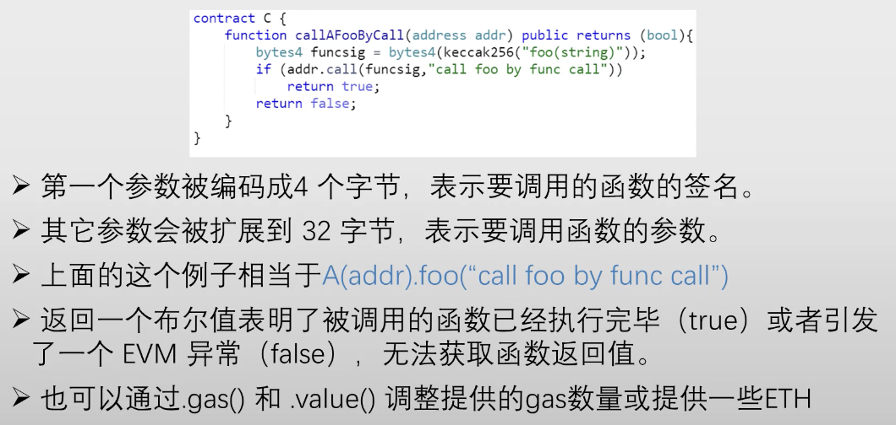

#### （3）代理使用 delegatecall()

和 call() 很像，区别是 delegatecall() 不需要切换到被调用的合约的环境中去执行，而是在当前合约的环境中执行

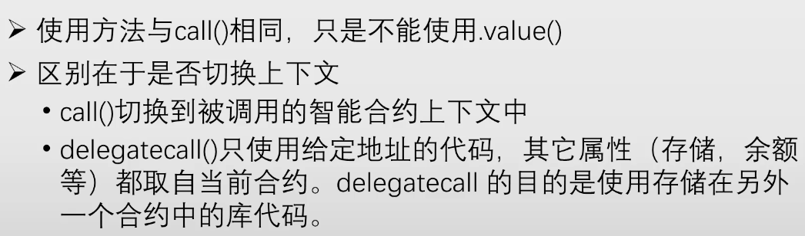

### 3、fallback() 函数

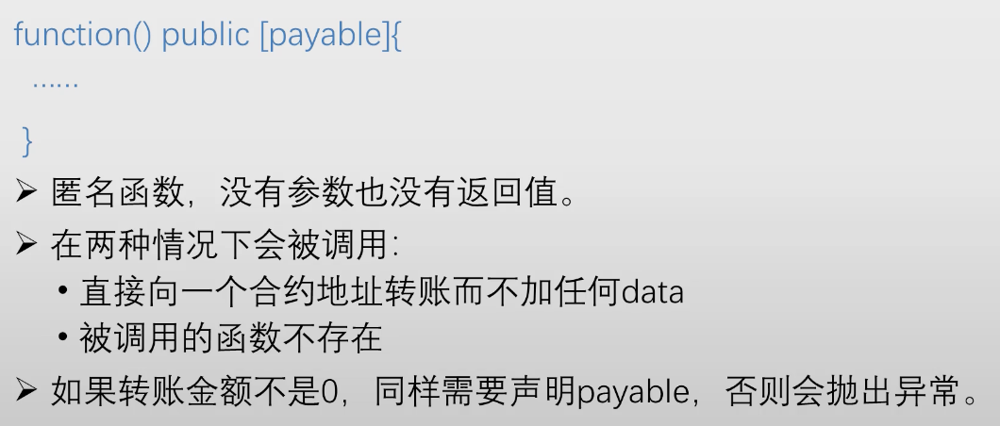

A 调用 B 的合约，要在转账交易里的 data 域说明调用的是 B 中的哪个函数。如果 A 给合约 B 转了一笔钱，没有说明掉的是哪个函数（或者调的函数在 data 域中不存在），此时缺省就调用 fallback() 函数

在交易中，转账金额可以为 0，但是汽油费不能为 0，因为没有汽油费，发布该区块的矿工就不会将该笔交易打包进去

## 四、智能合约的创建和运行

智能合约是由某个外部账户发起一个转账交易，转给 0X0 地址，转账金额为 0，然后把要发布的合约的代码放到 data 域里

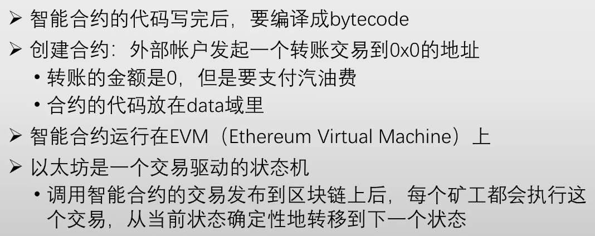

JVM 的目的是增强可移植性，EVM 也是类似的思想，通过加一层虚拟机，对智能合约的运行提供一个一致性的平台，所以 EVM 有时叫做 world wide computer，EVM 的寻址空间非常大，为 256 位

## 五、汽油费

比特币的设计理念很简单，功能有限（比如不支持循环）；而以太坊需要提供一个 Turing-complete Programming Model（图灵完备的编程模型），包含条件控制、循环和递归、数据存储、基本的算术运算功能，但也可能带来问题，比如出现死循环

一个全节点收到一个对智能合约的调用，不知道该调用执行起来是否会导致死循环，这叫做 Halting Problem（停机问题），这个问题是不可解的，不是 NPC 问题（Non-deterministic Polynomial 的问题，即多项式复杂程度的非确定性问题，NPC 是可解的，只是没有多项式时间的解法）

以太坊引入了汽油费机制，发起一个对智能合约的调用，就要支付相应的汽油费

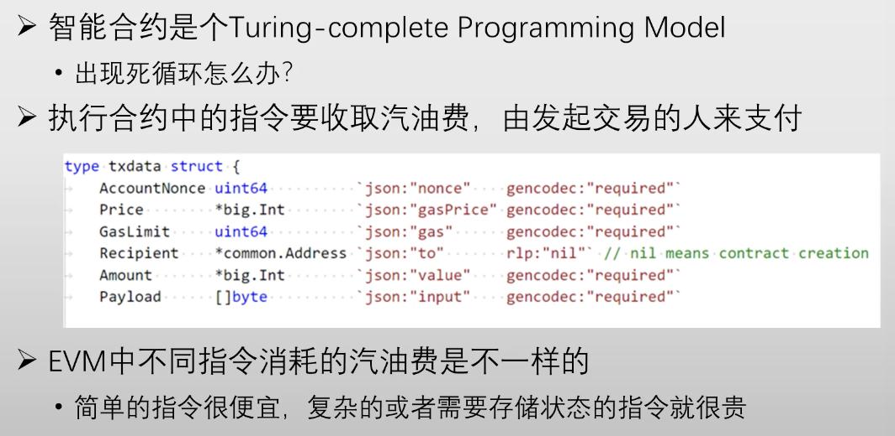

当一个全节点收到一个对智能合约的调用时，先按照调用中给出的 gasLimit，算出可能花掉的最大汽油费，然后一次性把汽油费从发起调用的账户上扣除，然后再根据实际执行的情况，算出实际花了多少汽油费（多退）

不同的指令消耗的汽油费不同，简单的指令（比如加减法），消耗的汽油费是很少的，复杂的指令消耗的汽油费就比较多（比如取哈希）；除了计算量，需要存储状态的指令消耗的汽油费也比较大；只需读取公共指令的命令是免费的

## 六、错误处理

以太坊中的交易执行起来具有原子性，一个交易要么全部执行、要么完全不执行，不会只执行一部分，既包含普通的转账交易，也包含对智能合约的调用。所以如果在执行智能合约的过程中，出现任何错误，会导致整个交易的执行回滚，退回到开始执行前的状态

### 1、出现错误的情况

（1）交易执行结束后，没有达到当初的 gas limit，多余的汽油费会被退回到这个账户里；相反的，如果执行一半，gas limit 已经都用完了，这时合约的执行会退回到开始执行之前的状态，且已经消耗掉的汽油费是不退的

（2）抛出错误的语句 assert（通常判断内部条件），require（通常判断外部条件，比如函数输入是否符合要求），revert（无条件抛出异常，原来是 throw）。sodility 当中没有 try catch 这种结构

### 2、嵌套调用

如果嵌套调用，一个智能合约调用另外一个智能合约，被调用的智能合约出现错误，不一定会导致发起调用的智能合约也跟着一起回滚，即连锁式回滚

这取决于调用智能合约的方式，如果这个智能合约是直接调用，就会触发连锁式回滚；如果用 call() 的方式，就不会连锁回滚，而是返回一个 false

如果只是向一个账户里转账，但该账户为合约账户，该操作就有可能触发对函数的调用，因为如果没有指明哪个函数，仍会调用 fallback() 函数

## 七、Block header

gasUsed 是该区块里所有交易所消耗的汽油费的总和

发布区块需要消耗一定的资源，需要对消耗的资源有一个限制（类似比特币区块大小不能超过一兆），gasLimit 是该区块里所有交易实际能够消耗汽油的上限

比特币区块一兆大小的限制是固定的，但是以太坊的 gasLimit 也有一个上限，但是每个矿工发布区块时，可以对 gasLimit 进行微调，即在上一个区块 gasLimit 的基础上 上调或下调 1/1024

## 八、思考

### 1、先挖矿还是先执行

前置知识：任何对状态的修改，都是在改本地的数据结构，只有当合约执行完了，发布到区块链之后，这些本地的修改才会变成外部可见的、变成区块链上的共识

假设某个全节点要打包一些交易到一个区块里，这些交易里有一些是对智能合约的调用，那么全节点是先把这些智能合约都执行完再去挖矿，还是应该先挖矿、获得记账权之后，再执行合约？

答案是先执行智能合约，因为不先执行，更新三颗树（状态、交易、收据），就无法得到三颗树的根哈希，也就无法通过 block header 去挖矿

### 2、是否会存在故意不验证的全节点

汽油费的设置是对于矿工执行智能合约所消耗资源的一种补偿，但是这种补偿只有最终挖到矿的矿工才能得到

如果某个区块不验证新发布的交易，不去执行新发布的区块，也就没办法更新本地的三棵树，以后就没办法再发布区块

### 3、合约执行错误能否上链

如果智能合约执行的过程中出现了错误，也要发布到区块链上，否则汽油费扣不掉。也就是说发布到区块链上的交易不一定都是成功执行的

### 4、智能合约是否支持多线程

多核处理器很普遍，但是智能合约不支持多核并行处理，sodility 没有支持多线程的语句，原因是：以太坊是一个交易驱动的状态机，状态机必须是完全确认性的，给定同一组输入，产生的输出/转移到的下一个状态必须是完全确定的。因为所有的全节点都得执行同一组操作，达到同一个状态，如果不确定的话，三个树的根哈希值根本对不上。多线程的问题是多个核对内存访问顺序不同的话，执行结果有可能不确定

除了多线程之外，其他可能造成执行结果不确定的操作也都不支持，比如：产生随机数，所以以太坊中的智能合约没办法产生真正意义下的随机数，只能用伪随机数

## 九、收据树

下面是 Receipt 的数据结构：

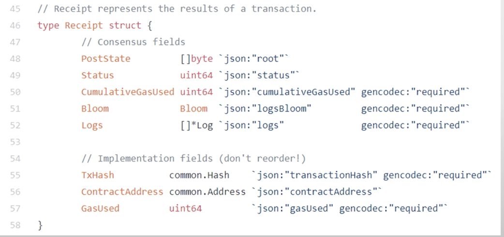

每个交易执行完之后会形成一个收据，status 表示交易的执行情况

## 十、智能合约可以获得的信息

### 1、智能合约可以获得的区块信息

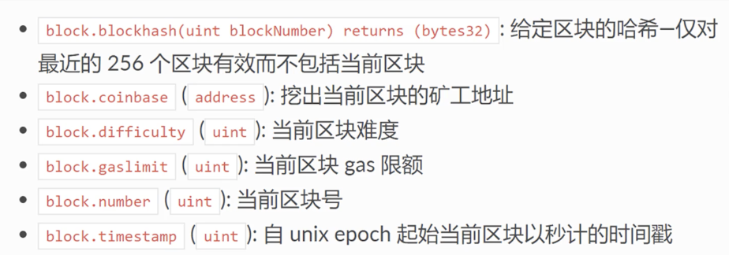

### 2、智能合约可以获得的调用信息

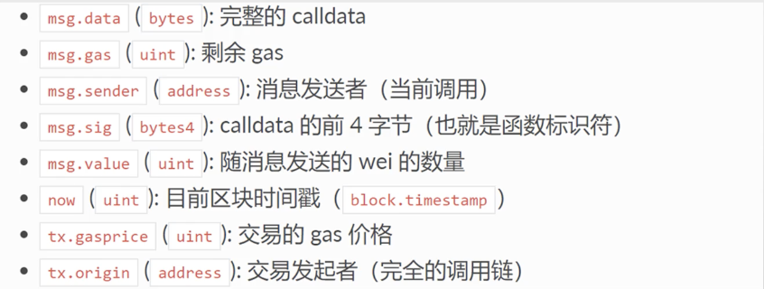

msg.data 说明了调用哪个函数，和该函数的参数取值

msg.gas 是剩余的汽油费，决定了还能做那些操作，想要再调用其他合约，前提是有足够的汽油费剩余

msg.sig 是 msg.data 的前四个字节，即函数标识符，表示调用的是哪个函数

now 是当前区块的时间戳，等同于图区块信息中的 block.timestamp

消息发送者 msg.sender 和 交易发起者 tx.origin 是不一样的

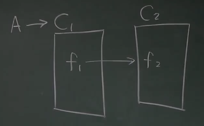

比如上述交易，对于 f2，msg.sender 是 C1，但是 tx.origin 是 A

### 3、地址类型

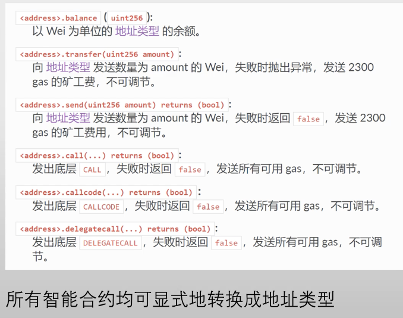

addr.balance 是成员变量，剩余的都是成员函数

addr.transfer(amount) 是当前合约往地址 addr 转入 amount 以太币，转入的地址是 addr，转出的地址是该合约地址

addr.call() 合约账户发起对 addr 这个合约的调用

### 4、三种发送 ETH 的方式

```
addr.transfer(amount)
addr.send(amount) return (bool)
addr.call.value(amount)()
```

（1）transfer 会导致连锁性的回滚；失败时抛出异常；为要调用的合约提供 2300 汽油费（少量）

（2）send 在失败时会返回一个 false；不会导致连锁式回滚；为要调用的合约提供 2300 汽油费（少量）

（3）call 在失败时会返回一个 false；不会导致连锁式回滚；会将当前调用剩下的所有汽油都发送给要调用的合约，合约后续会执行什么操作当前账户无法控制

## 十一、智能合约拍卖实例

这部分结合智能合约拍卖实例，讲述可能存在的安全漏洞，代码截图较多，视频链接如下（1小时31分25秒）：

https://www.bilibili.com/video/BV1Vt411X7JF/?spm_id_from=333.788.player.switch&vd_source=69ac93649ea21c4726fe85f272b6d968&p=22
