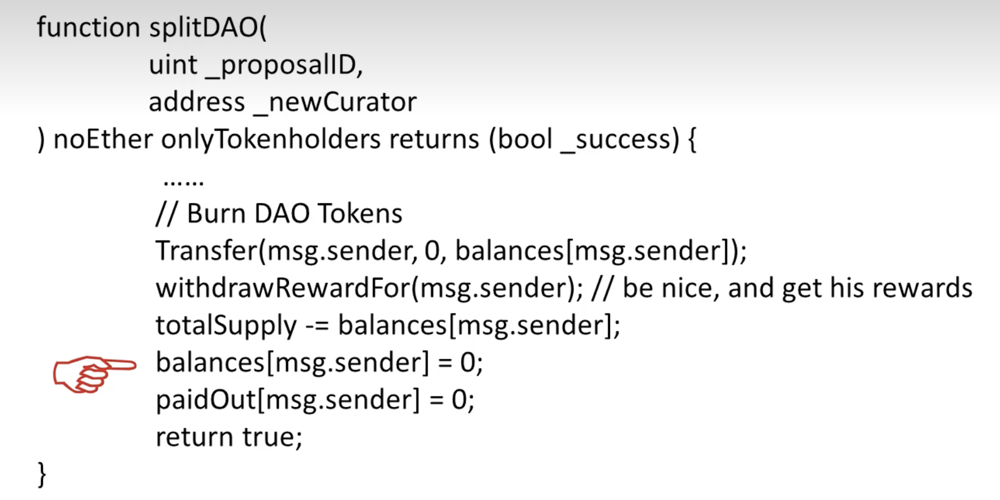

- DAO（Decentralized Autonomous Organization）
- DAC（Decentralized Autonomous Corporation）

The DAO 事件是以太坊历史上一个重要的里程碑，涉及到智能合约的漏洞、重组攻击、以及随后的硬分叉。这一事件导致以太坊网络分裂成了两个不同的区块链：以太坊（ETH）和以太坊经典（ETC）

### 1、背景

The DAO 是一个基于以太坊的去中心化投资基金，旨在为各种项目提供资金，在 2016年4月 成功筹集了超过 1.5亿美元 的以太币，成为当时最大的众筹项目。然而，其智能合约存在一个安全漏洞，并终导致了黑客的攻击

拆分（splitDAO），用于建立子基金（childDAO），一般用于小众项目，会将这些账户中的代币全部换回以太币、并打入子基金中。极端情况下，单个投资者可以成立一个子基金，用于取回个人的收益（注意：成立的子基金具有 28天 的锁定期）

### 2、漏洞与重组攻击

有问题的代码段如下所示：

正确的操作顺序是先把账户清零 `balance[msg.sender]=0`，然后再把钱还给调用该函数的人 `withdrawRewardFor(msg.sender)`，并对 The DAO 中的总金额减少相应的数量 `totalSupply -= balances[msg.sender]`

攻击者利用该漏洞进行了重组攻击，通过递归调用（Reentrancy）的机制，在第一次调用合约未完成之前 再次调用原合约，从而重复提取资金，导致约 5000万美元 被转移到攻击者的合约账户中

### 3、尝试修复：软分叉

在 28天 的锁定期内尝试修复，第一步锁定黑客的账户，第二步清退 The DAO 基金上的钱

以太坊发布了软件升级，新增了一条规则：凡是和 The DAO 基金上的账户相关的，不许做任何交易。大多数矿工都升级了该软件

这属于软分叉，因为新节点不认（包含和 The DAO 基金账户相关的交易）旧节点，而旧节点认可新节点

但是升级后的软件存在另一个 bug：判断和 The DAO 基金上的账户相关的交易都是非法交易，不予执行，此时没有收取汽油费。这导致了 Denial-of-service Attack（DOS 攻击）：造成大量恶意攻击者不断发放非法交易，浪费矿工的资源

### 4、硬分叉的实施

以太坊发布了软件升级，把 The DAO 上的所有基金强行转到另一个新的智能合约上，该智能合约的唯一功能就是退钱（将代币退回为以太币）

这属于硬分叉，因为本来转账需要有合法的签名，但是用该合约规定，挖到第 192万 个区块时，自动执行该转账交易，不需要任何签名。因此旧矿工不会认可该区块，因为没有合法签名属于非法交易

### 5、分裂成 ETH 和 ETC

硬分叉之后的新链仍然称作 ETH，旧链上挖出的币叫做 ETC（Etherum Classic）

后来由于新旧链并行会引发重放攻击，在两条链上分别加上了不同的 Chain ID 用于区分
