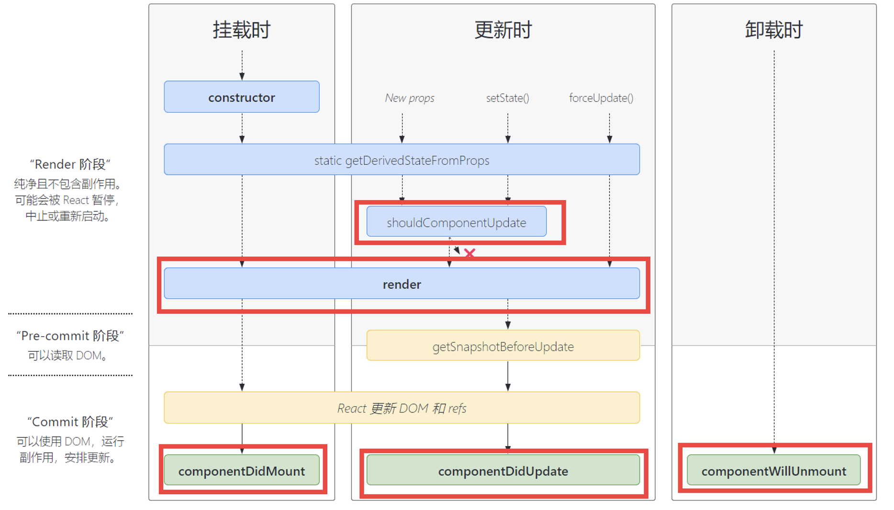

## 一、项目的创建

### 1、创建方式

#### （1）使用官方的脚手架

```
npx create-react-app <projectname>
```

只做 React 基本的搭建和构建，没有路由和状态管理，项目使用 Webpack 构建

#### （2）使用一些市场上的集成脚手架

官方脚手架提供的项目模板非常简单，因此也有很多集成的脚手架，比如：umi

这类脚手架创建的项目会集成很多功能，比如：路由、mock

### 2、两个核心库

#### （1）React

创建一个 React 对象，提供 React 的各个功能

#### （2）React-dom

提供一些 DOM 操作方法，用于把 React 创建出来的 React 对象 挂载到真正的 html DOM 中，或者从 HTML DOM 中卸载，作用类似于 Vue 的 mount

## 二、React 组件 和 JSX

### 1、组件分类

#### （1）函数组件

``` js
function Hello() {
    return <div>hello</div>
}
```

#### class 组件（老版本）

``` js
class Hello extends React.Component {
    render () {
        return <div>hello</div>
    }
}
```

### 2、JSX 特点

#### （1）直接在 JS 中混用

React 项目利用 Babel 做了对 JS 的编译，所以能直接在 JS 里写 JSX

#### （2）写法接近 JS

JSX 几乎和 JS 一样，不同点在于，可以在 JS 里写 HTML，且写在 JS 里的 HTML 最后会被编译成一个 JS 对象，也可以用 React 自带 createElement 创建这个对象

``` js
  function FnHello() {
    // return <div>hello</div>
    return React.createElement("div", [], "Hello")
  }
```

### 3、JSX 里面渲染不同内容的区别

（1）字符串、数字：直接渲染

（2）对象：只能渲染 element 对象，否则会报错

（3）数组：把数组中的每一项单独渲染

（4）表达式：运行表达式

（5）方法：无法渲染

（6）布尔值，undifined, null：不渲染

``` js
import React from 'react';

function App() {
  // 新版本 - vue3 组合式 API
  // 首字母一定要大写，区分组件和方法
  function FnHello() {
    // return <div>hello</div>
    return React.createElement("div", [], "Hello")
  }

  // 老版本 - vue2 选项式 API
  class ClassHello extends React.Component {
    constructor(props) {
      super(props)
    }
    render() {
      return <div>hello class</div>
    }
  }

  console.log("FnHello", FnHello) // 方法
  console.log("<FnHello/>", <FnHello/>) // React element（虚拟 DOM）
  
  let eleObj = FnHello()
  let com1 = <ClassHello></ClassHello>
  
  let obj = { a: 123 }
  let arr = [com1, 5, 'abc']
  return (
    <div className="App">
      <FnHello></FnHello>
      <ClassHello></ClassHello>
      -------
      {eleObj}
      {com1}
      -------
      {"Hello Str"}
      {123}
      {/* {obj} 报错 */}
      {/* {FnHello} 报错 */}
      {arr}
      {1+2+3+4}
      {true?<FnHello></FnHello>:'123'}
      {/* {false} 不展示 */}
      {/* {undefined} 不展示 */}
      {/* {null} 不展示 */}
    </div>
  );
}

export default App;
```

## 三、React 的时事件绑定

### 1、规则模式

（1）类似于原生，on+方法名（首字母大写，为了和原生区分）

（2）一定要赋值给事件一个方法

### 2、特别注意的问题

（1）不作处理的情况下，this 会指向 undefined

（2）事件绑定的必须是一个方法，不要直接调用方法，否则只会在页面初次渲染时执行

### 3、事件绑定其他操作

（1）传递参数

（2）获取事件对象

（3）阻止默认行为，冒泡等

``` js
import React from 'react';

class App extends React.Component {
  /**
   * 1、方法调用使用 bind 规定 this（可以）
   * 2、写成一个匿名箭头函数
   * 3、方法本身写成箭头函数（可以）
   */
  f1() {
    console.log("this", this) // 不用 bind 的话，默认指向 undefined
  }

  f2 = () => {
    console.log("this", this) // 使用箭头函数
  }

  f3(a, b) {
    console.log("a + b =", a + b)
  }

  f4 = (a, b) => {
    console.log("a + b =", a + b)
  }

  f5(a) {
    console.log("a", a)
  }

  f6(a, b, e) {
    // 不是原生的事件对象（在 nativeEvent 中），而是合成的事件对象
    console.log("e", e)
    /**
     *     event.stopPropagation(); // 原生阻止冒泡
     *     event.preventDefault(); // 原生阻止默认
     */
    e.stopPropagation(); // 阻止冒泡
    e.preventDefault(); // 阻止默认
  }

  render() {
    return <div className="App">
      <div onClick={() => {
        console.log(1)
      }}>123</div>

      <div onClick={this.f1.bind(this)}>456</div>
      <div onClick={this.f2}>789</div>
      {/* 不能传方法的调用 */}
      <div onClick={this.f2()}>error</div>

      {/* 箭头函数改变 this 指向 */}
      <div onClick={() => {
        console.log("this", this)
      }}>匿名1</div>
      
      {/* 普通函数不行 */}
      <div onClick={function () {
        console.log("this", this)
      }}>匿名2</div>

      {/* 事件传参 */}
      {/* 1、普通函数.bind() + 普通函数 */}
      <div onClick={this.f3.bind(this, 1, 2)}>传参1</div>
      {/* 2、箭头函数 + 箭头函数 */}
      <div onClick={() => this.f4(1, 2)}>传参2</div>

      {/* 获取事件对象 */}
      {/* 1、不传参 */}
      <div onClick={this.f5.bind(this)}>事件1</div>
      {/* 2、传参 */}
      <div onClick={this.f6.bind(this, 1, 2)}>事件2</div>
    </div>
  }
}

export default App;

```

## 四、React 中的响应式数据

### 1、类组件响应式数据

响应式数据定义在类的 state 属性中

``` js
class ClassState extends React.Component {
    constructor(props) {
        super(props)
        this.state = {
            // 这里写响应式数据，类似 vue 的 data 方法返回的对象
            a: 123
        }
    }
}
```

### 2、React 响应式原理

（1）React 不能像 Vue 一样直接修改触发更新

（2）React 修改能改值，但无法触发更新，因为 React 不像 Vue 监听了 get 和 set，而是在调用 setState 时调用 React 的更新操作

### 3、setState 关键点

（1）通过浅合并来修改数据

（2）调用 setState 方法会触发更新，修改 state 不会触发更新

（3）setState 方法是异步的，如果要获取修改后的值，需要在 setState 的第二个参数里获取

（4）setState 方法多次修改，会合并为一次，统一更新

（5）setState 返回会触发更新，不管是否有修改，这导致：重复修改为相同的值也会让组件更新

（6）一定不要在 render 里直接 setState

### 4、PureComponent 下对于对象和数组的修改

PureComponent 会根据 state 是否改变来决定是否更新，而对于对象、数组这种引用类型判断是否改变的原理是看内存地址，而不是内容

因此在 PureComponent 下修改对象和数组，需要声明一个新对象赋值。所以一般不直接操作原对象，而是先拷贝一份，再进行操作

``` js
import React from 'react';

// 解决了普通 component 的一些问题，比如：更新为同一个值仍然重新渲染
class App extends React.PureComponent {
  // 老写法
  // constructor(props) {
  //   super(props)
  //   this.state = {
  //     ...
  //   }
  // }

  // 新写法
  state = {
    a: 0,
    b: 1,
    c: {
      c1: 123,
      c2: 999
    },
    arr: [1, 2, 3]
  }

  addA = () => {
    // 常用
    this.setState({
      a: this.state.a + 1
    })

    // 也可以更新
    // this.state.a += 1
    // this.setState({})

    // 函数形式，不常用
    // this.setState((state) => {
    //   return {
    //     a: state.a + 1
    //   }
    // })

    this.setState({
      a: this.state.a + 1
    })

    console.log("this.state.a", this.state.a)
  }

  merge = () => {
    // 浅合并，只合并外层
    // 为异步操作
    this.setState({
      a: 1,
      b: 2,
      c: {
        ...this.state.c,
        c1: 9
      }
    }, () => {
      // 回调中才能获取更新后的值
      console.log("this.state0", this.state)
    })
    console.log("this.state1", this.state)
  }

  refresh = () => {
    this.setState({
      a: 1
    })
    this.setState({
      b: 2
    })
    // 以上等同于
    // Object.assign(this.state, {a: 1}, {b: 2})
  }

  // 数组和对象，是通过内存地址判断是否改变的
  addArr = () => {
    let arr_ = [...this.state.arr]
    arr_.push(4)
    this.setState({
      // arr: this.state.arr
      arr: arr_
    }, () => {
      console.log("this.state.arr", this.state.arr)
    })

    this.setState({
      c: {
        ...this.state.c,
        c1: 8888
      }
    }, () => {
      console.log("this.state.c", this.state.c)
    })
  }

  render() {
    console.log(123)
    // 不能在 render 中使用 this.setState，会死循环
    return <div className="App">
      {this.state.a}
      <button onClick={() => this.addA()}>加1</button>
      <button onClick={() => this.merge()}>合并</button>
      <button onClick={() => this.refresh()}>更新</button>
      {this.state.arr}
      <button onClick={() => this.addArr()}>数组增加</button>
    </div>
  }
}

export default App;
```

## 五、条件渲染和列表循环

React 没有 Vue 一样的指令，一切操作本质上是通过运算生成不同的内容，再渲染得到不同的页面

``` js
import React from 'react';

class App extends React.PureComponent {
  state = {
    show: true,
    originArr: [1, 2, 3] // [1, 2, 3] => [<div>1</div>, <div>2</div>, <div>3</div>]
  }

  f1() {
    if(this.state.show) {
      return <div>div1</div>
    }
    return ""
  }

  getArr() {
    let newArr = []
    this.state.originArr.forEach((item) => {
      newArr.push(<div>{item}</div>)
    })
    console.log('newArr', newArr)
    return newArr
  }

  addData = () => {
    let _arr = [...this.state.originArr]
    _arr.push(Math.random() * 10)
    this.setState({
      originArr: _arr
    })
  }

  render() {
    return <div className="App">
      <div>条件渲染</div>
      {/* {this.state.show ? <div>div1</div>: ""} */}
      {this.f1()}
      <button onClick={() => {
        this.setState({
          show: !this.state.show
        })
      }}>{this.state.show ? "隐藏" : "显示"}</button>

      <div>列表渲染</div>
      {/* { this.getArr() } */}
      {
        this.state.originArr.map((item) => {
          return <div key={item}>{item}</div>
        })
      }
      <button onClick={() => this.addData()}>添加</button>
    </div>
  }
}

export default App;
```

## 六、表单绑定

React 中很多思路都是按原生的操作去做的，表单绑定也是如此

原生表单获取表单输入值，可以通过监听 input、change 等事件，然后获取 e.target.value

如果要设置表单的值，通常设置 value 属性，如果是选择框则是 checked 属性

``` js
import React from 'react';

class App extends React.PureComponent {
  state = {
    inputValue: "",
    checkedArr: ["c2"]
  }

  handleChecked = (e) => {
    let arr = [...this.state.checkedArr]
    if(e.target.checked) {
      arr.push(e.target.value)
    }
    else {
      arr.splice(arr.indexOf(e.target.value), 1)
    }
    this.setState({
      checkedArr: arr
    })
  }
  
  render() {
    return <div className="App">
      {/* <input onBlur={} /> */}
      {/* <input onChange={} /> */}
      <input value={this.state.inputValue} onInput={(e) => {
        this.setState({
          inputValue: e.target.value
        })
      }} />
      { this.state.inputValue }

      {/* checkbox */}
      <input checked={this.state.checkedArr.indexOf("c1")!==-1} type="checkbox" value="c1" name="choose" onChange={this.handleChecked} />
      <input checked={this.state.checkedArr.indexOf("c2")!==-1} type="checkbox" value="c2" name="choose" onChange={this.handleChecked} />
      <input checked={this.state.checkedArr.indexOf("c3")!==-1} type="checkbox" value="c3" name="choose" onChange={this.handleChecked} />
      { this.state.checkedArr }
    </div>
  }
}

export default App;
```

## 七、props 和组件间传值、插槽

props 是 React 中的核心，一切写在组件上的属性和子节点都被划为 props

React 父子传值，插槽全都基于 props，不像 Vue 有事件监听、emit、专门的插槽 这类东西

``` js
/* App.js */
import React from 'react';
import Son from './Son';

class App extends React.PureComponent {
  state = {
    // msg: 123 // 抛出类型错误
    msg: "app message"
  }

  changeMsg = (sonMsg) => {
    console.log("sonMsg", sonMsg)
    this.setState({
      msg: sonMsg
    })
  }
  
  render() {
    return <div className="App">
      I'm App.
      <br></br>
      {/* 具名插槽 */}
      {/* 在插槽中显示子组件内容 */}
      {/* <Son msg={this.state.msg} a={<div>I'm slot2</div>} scopeslot={(scope) => {
        return <div>scope: {scope}</div>
      }}>
        <div>I'm slot</div>
      </Son> */}

      <Son msg={this.state.msg} changeMsg={this.changeMsg}>

      </Son>
    </div>
  }
}

export default App;
```

``` js
/* Son.js */
import React from "react"
import proptypes from "proptypes"

class Son extends React.PureComponent {
    // constructor(props) {
    //     super(props)
    //     this.state = {
    //         sonMsg: "hello"
    //     }
    // }

    state = {
        sonMsg: "son message"
    }

    render() {
        // console.log("this.props", this.props)
        // return <div>
        //     {/* 具名插槽 */}
        //     {this.props.a}

        //     {"this.props.msg: " + this.props.msg}
        //     <br></br>
        //     {"this.state.sonMsg: " + this.state.sonMsg}
        //     <br></br>
        //     I'm Son.
        //     {this.props.children}
        //     {/* 在插槽中显示子组件内容 */}
        //     {this.props.scopeslot(this.state.sonMsg)}
        // </div>

        return <div>
            {this.props.msg}
            <button onClick={() => this.props.changeMsg("hello, father")}>修改</button>
        </div>
    }
}

// Son.propTypes = {
//     msg: function(props) {
//         if (typeof props.msg !== "string") {
//             throw new Error("msg must be a string")
//         }
//     }
// }
// proptypes 库
Son.propTypes = {
    msg: proptypes.string
}

Son.defaultProps = {
    msg: "default"
}

export default Son;
```

## 八、React 样式设置

### 1、class 类名设置

（1）必须写为 className

（2）类名和样式写在 css 文件里

（3）必须接受一个字符串
 
### 2、style 内联

不能像原生一样写成字符串，必须写成对象

``` js
/* App.js */
import './App.css';
import React from 'react';
import Son from './Son';

class App extends React.PureComponent {
  state = {
    msg: "app message"
  }
  
  render() {
    return <div>
      <div className="father" style={
        {
          background: "yellow",
          fontSize: "25px"
        }
      }>father</div>
      <Son></Son>
    </div>
  }
}

export default App;
```

``` js
/* Son.js */
import React from "react"
import proptypes from "proptypes"
// import "./Son.css"
import sonStyle from "./Son.module.css"
// console.log("sonStyle", sonStyle)
// 组件名 - .module.css
// vue style scoped
// import classnames from "classnames" // 非模块化
import classnames from "classnames/bind" // 模块化
let bindClassnames = classnames.bind(sonStyle) // 模块化方法
let str = classnames({
    son: true,
    son1: true
})
console.log("str", str)
// 更方便操作类名的库 - classnames
// 本质是生成一个字符串

class Son extends React.PureComponent {
    state = {
        sonMsg: "son message",
        hasSon1: false
    }

    render() {
        return <div>
            {/* 取出新的 class 名 */}
            <div className={sonStyle.son + " " + sonStyle.son1}>son1</div>
            
            {/* classnames 库 */}
            {/* 非模块化 */}
            <div className={classnames({
                son: true,
                son1: this.state.hasSon1
            })}>son2</div>
            {/* 模块化 */}
            <div className={bindClassnames({
                son: true,
                son1: this.state.hasSon1
            })}>son3</div>
        </div>
    }
}

// proptypes 库
Son.propTypes = {
    msg: proptypes.string
}

Son.defaultProps = {
    msg: "default"
}

export default Son;
```

``` css
/* App.css */
.father {
  color: red
}
```

``` css
/* Son.module.css */
.son {
    color: blue
}
.son1 {
    background-color: bisque;
}
```

## 九、React 生命周期

### 1、生命周期图示



### 2、严格模式

严格模式只在开发模式下生效，生产上线时会去除，作用如下：

（1）检测危险操作（比如：使用已经废弃 api 和不推荐的 api）

（2）把生命周期执行两次，来检测额外副作用（比如：render）

``` js
/* index.js */
const root = ReactDOM.createRoot(document.getElementById('root'));
root.render(
  // 严格模式
  <React.StrictMode>
    <App />
  </React.StrictMode>
);
```

### 3、React 和 Vue 更新

#### （1）Vue

Vue 是在 get 和 set 里触发更新，在 get 部分会进行依赖收集的操作

在更改数据后，只会更新用到该数据的地方，做到最小的更新范围

#### （2）React

React 的更新是调用方法时触发的，没有依赖收集的过程

所以会更新整个组件树、同时更新子组件，即使更新的数据和子组件没有关系

``` js
/* App.js */
import './App.css';
import React from 'react';
import Son from './Son';

class App extends React.Component {
  constructor(props) {
    super(props)
    this.state = {
      msg: "app message"
    }
    console.log("constructor")
  }

  // derived 派生的
  static getDerivedStateFromProps(props, state) {
    console.log("derived")
    console.log("derived-props", props)
    console.log("derived-state", state)
    return null
  }

  // 优化生命周期（只能在 React.Component 中使用，因为 PureComponent 已经实现了）
  shouldComponentUpdate(props, state) {
    console.log("shouldUpdate")
    // console.log("shouldUpdate-props", props)
    console.log("shouldUpdate-this.state 修改前", this.state)
    console.log("shouldUpdate-state 修改后", state)
    // 实现 PureComponent 优化
    for(let item in this.state) {
      if(this.state[item] != state[item]) {
        return true
      }
    }
    return false
  }
  
  // 一定不要修改数据
  render() {
    console.log("render")
    return <div>
      <div className="father">
        <div>{this.state.msg}</div>
        <button onClick={() => {
          this.setState({
            msg: "hello"
          })
        }}>修改msg</button>
        <Son></Son>
      </div>
    </div>
  }

  // 类似 Vue mounted
  componentDidMount() {
    console.log("didMount")
  }

  // 类似 Vue updated
  componentDidUpdate() {
    console.log("didUpdate")
  }

  // 类似 Vue unmounted
  componentWillUnmount() {
    console.log("willUnmount")
  }
}

export default App;
```

``` js
/* Son.js */
import React from "react"
import proptypes from "proptypes"

// 如果使用 Component，父组件更新会导致子组件更新，即使子组件数组没变化
class Son extends React.Component {
    state = {
        sonMsg: "son message",
        hasSon1: false
    }

    render() {
        console.log("son render")
        return <div>
        </div>
    }
}

// proptypes 库
Son.propTypes = {
    msg: proptypes.string
}

Son.defaultProps = {
    msg: "default"
}

export default Son;
```
