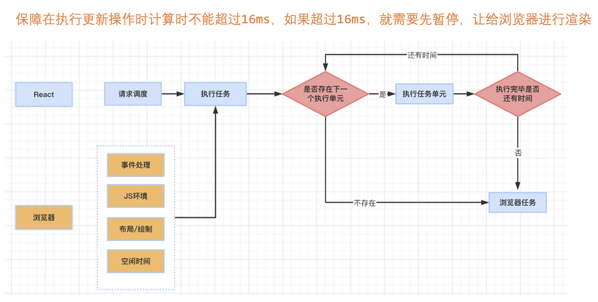
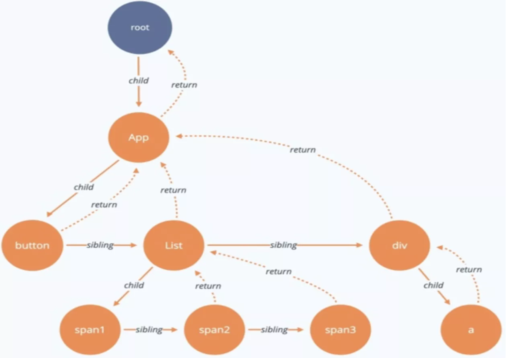

## 十、实战-制作一个增删改查列表

``` js
/* App.js */
import "./App.css";
import React from "react";
import axios from "axios";
import Pop from "./Pop";

// 状态列表
let arr = [
  {
    text: "进行中",
    color: "blue",
  },
  {
    text: "已完成",
    color: "green",
  },
  {
    text: "已延期",
    color: "red",
  },
];

class App extends React.Component {
  state = {
    tableArr: [],
    searchParams: {
      dateValue: "",
      nameValue: "",
      statusValue: 0,
    },
    popForm: {
      dateValue: "",
      nameValue: "",
      statusValue: 0,
    },
    popShow: false,
    popTitle: undefined,
    // confirmFn: undefined,
  };

  componentDidMount() {
    this.getList();
  }

  // 查询列表
  getList(params) {
    axios({
      url: "http://localhost:8000/list",
      method: "get",
      params,
    }).then((res) => {
      console.log("res", res);
      this.setState({
        tableArr: res.data.data,
      });
    });
  }

  // 展示状态文字
  showStatus(status) {
    return (
      <span
        style={{
          color: arr[status]?.color,
        }}
      >
        {arr[status]?.text}
      </span>
    );
  }

  // 搜索
  searchData() {
    this.getList({
      date: this.state.searchParams.dateValue,
      name: this.state.searchParams.nameValue,
      status: this.state.searchParams.statusValue,
    });
  }

  // 重置
  resetData() {
    this.setState(
      {
        searchParams: {
          dateValue: "",
          nameValue: "",
          statusValue: 0,
        },
      },
      () => {
        this.getList();
      }
    );
  }

  // 新增
  addFn() {
    axios({
      url: "http://localhost:8000/addOrder",
      method: "post",
      data: this.state.popForm,
    }).then((res) => {
      console.log("addFn res", res);
      this.setState({
        popShow: false,
      });
      this.getList();
    });
  }

  // 编辑
  updateFn() {
    axios({
      url: "http://localhost:8000/updateOrder",
      method: "post",
      data: this.state.popForm,
    }).then((res) => {
      console.log("updateFn res", res);
      this.setState({
        popShow: false,
        popForm: {
          dateValue: "",
          nameValue: "",
          statusValue: 0,
        },
      });
      this.getList();
    });
  }

  // 删除
  deleteFn(id) {
    axios({
      url: "http://localhost:8000/updateOrder",
      method: "post",
      data: {
        id
      },
    }).then((res) => {
      console.log("deleteFn res", res);
      this.getList();
    });
  }

  render() {
    return (
      <div>
        <div>
          <label>日期</label>
          <input
            value={this.state.searchParams.dateValue}
            onInput={(e) => {
              this.setState({
                searchParams: {
                  ...this.state.searchParams,
                  dateValue: e.target.value,
                },
              });
            }}
          />
          <label>订单名</label>
          <input
            value={this.state.searchParams.nameValue}
            onInput={(e) => {
              this.setState({
                searchParams: {
                  ...this.state.searchParams,
                  nameValue: e.target.value,
                },
              });
            }}
          />
          <label>订单状态</label>
          <select
            value={this.state.searchParams.statusValue}
            onChange={(e) => {
              this.setState({
                searchParams: {
                  ...this.state.searchParams,
                  statusValue: e.target.value,
                },
              });
            }}
          >
            {arr.map((item, index) => {
              return (
                <option value={index} key={index}>
                  {item.text}
                </option>
              );
            })}
          </select>
          <button onClick={() => this.searchData()}>搜索</button>
          <button onClick={() => this.resetData()}>重置</button>
        </div>

        {/* 新增按钮 */}
        <div>
          <button
            onClick={() => {
              this.setState({
                popShow: true,
                popTitle: "新增",
                // confirmFn: this.addFn.bind(this),
              });
            }}
          >
            新增
          </button>
        </div>

        {/* 表格 */}
        <table>
          <thead>
            <tr>
              <td>日期</td>
              <td>订单名</td>
              <td>订单状态</td>
              <td>操作</td>
            </tr>
          </thead>
          <tbody>
            {this.state.tableArr.map((item) => {
              return (
                <tr key={item.id}>
                  <td>{item.date}</td>
                  <td>{item.name}</td>
                  <td>{this.showStatus(item.status)}</td>
                  <td>
                    <button
                      onClick={() => {
                        this.setState({
                          popShow: true,
                          popTitle: "编辑",
                          popForm: {
                            dateValue: item.date,
                            nameValue: item.name,
                            statusValue: item.status,
                          },
                          // confirmFn: this.updateFn.bind(this)
                        });
                      }}
                    >
                      编辑
                    </button>
                    <button onClick={() => this.deleteFn(item.id)}>删除</button>
                  </td>
                </tr>
              );
            })}
          </tbody>
        </table>

        {/* 弹窗 */}
        {this.state.popShow ? (
          <Pop
            title={this.state.popTitle}
            confirm={
              this.state.popTitle === "新增"
                ? this.addFn.bind(this)
                : this.updateFn.bind(this)
            }
            cancel={() => {
              this.setState({
                popShow: false,
              });
            }}
          >
            <div>
              <div>
                <label>日期</label>
                <input
                  value={this.state.popForm.dateValue}
                  onInput={(e) => {
                    this.setState({
                      popForm: {
                        ...this.state.popForm,
                        dateValue: e.target.value,
                      },
                    });
                  }}
                />
              </div>
              <div>
                <label>订单名</label>
                <input
                  value={this.state.popForm.nameValue}
                  onInput={(e) => {
                    this.setState({
                      popForm: {
                        ...this.state.popForm,
                        nameValue: e.target.value,
                      },
                    });
                  }}
                />
              </div>
              <div>
                <label>状态</label>
                <select
                  value={this.state.popForm.statusValue}
                  onChange={(e) => {
                    this.setState({
                      popForm: {
                        ...this.state.popForm,
                        statusValue: e.target.value,
                      },
                    });
                  }}
                >
                  {arr.map((item, index) => {
                    return (
                      <option value={index} key={index}>
                        {item.text}
                      </option>
                    );
                  })}
                </select>
              </div>
            </div>
          </Pop>
        ) : null}
      </div>
    );
  }
}

export default App;
```

``` js
/* Pop.js */
import React from "react";
import popStyle from "./Pop.module.css";

class Pop extends React.PureComponent {
  render() {
    return (
      <div className={popStyle.cover}>
        <div className={popStyle.content}>
          <div className={popStyle.title}>
            {/* {this.props.title ? this.props.title : "标题"} */}
            {this.props.title}
          </div>
          {/* <div>{this.props.content}</div> */}
          <div>{this.props.children}</div>
          <div>
            <button onClick={() => this.props.confirm()}>确定</button>
            <button onClick={() => this.props.cancel()}>取消</button>
          </div>
        </div>
      </div>
    );
  }
}

Pop.defaultProps = {
  title: "标题",
};

export default Pop;
```

``` css
/* Pop.module.css */
.cover {
    position: fixed;
    top: 0;
    bottom: 0;
    left: 0;
    right: 0;
    background-color: rgba(0, 0, 0, 0.6);
}

.content {
    width: 500px;
    margin: 200px auto;
    background-color: #fff;
}

.title {
    padding: 30px;
    border-bottom: 1px solid #000;
}
```

## 十一、ref 和 context

### 1、ref

用于获取真实 DOM，和 Vue 中的 ref 类似，注意：

（1）ref 必须在挂载后才能获取，通常在 componentDidMount

（2）ref 只能获取类组件，不能获取函数组件

### 2、context

类似 Vue 的 provider 和 injected，用于嵌套很深的爷孙组件之间传值，注意：

子组件使用父组件创建的 context 对象，不能自己创建

``` js
/* App.js */
import React from "react";
import Son from "./Son";

let div1 = React.createRef()
let sonComp = React.createRef();

// 是一个组件
export let Context1 = React.createContext();

class App extends React.PureComponent {
  state = {
    msg: "父组件",
    passMsg: "传递消息"
  }

  // div1 = React.createRef()

  componentDidMount() {
    // 真实 DOM
    console.log("div1.current", div1.current)
    // 
    console.log("sonComp.current", sonComp.current)
  }

  render() {
    return (
      // 类似 Vue 中的 template
      <>
        <div className="App" ref={div1}>{this.state.msg}</div>
        
        {/* 只能使用 value 这一个 props */}
        <Context1.Provider value={this.state.passMsg}>
          <Son ref={sonComp}></Son>
        </Context1.Provider>
      </>
    );
  }
}

export default App;
```

``` js
/* Son.js */
import React from "react";
import GrandSon from "./GrandSon";

class Son extends React.PureComponent {
  state = {
    sonMsg: "子组件",
  };

  render() {
    return (
      <>
        <div className="Son">{this.state.sonMsg}</div>
        <GrandSon></GrandSon>
      </>
    );
  }
}

export default Son;
```

``` js
/* GrandSon.js */
import React from "react";
import { Context1 } from "./App";

class GrandSon extends React.PureComponent {
  state = {
    grandsonMsg: "孙子组件",
  };

  render() {
    return (
      <>
        <div className="Son">{this.state.grandsonMsg}</div>
        <Context1.Consumer>
          {
            (value) => {
              console.log(value);
              return <div>{value}</div>
            }
          }
        </Context1.Consumer>
      </>
    );
  }
}

export default GrandSon;
```

## 十二、函数组件 和 hook

### 1、函数组件和类组件的区别

（1）函数组件没有生命周期

（2）函数组件没有 this

（3）函数组件通过 hook 来完成各种操作

（4）函数组件本身的函数体相当于 render 函数

（5）props 在函数的第一个参数接受

### 2、useEffect()

不传第二个参数 = componentDidMount 和 componentDidUpdate

第二个参数传空数组 = componentDidMount

第二个参数数组里放某个数据 = watch 监听

### 3、useMemo()

让一段计算在开始运行一次，后续只有依赖的数据发生变化时才重新运算，作用：

（1）类似于 Vue 的一个计算属性的效果

（2）缓存一个数据，让其不会重新创建

### 4、 useCallback()

缓存一个方法，让方法不会每次更新都重新创建

### 5、其他 hooks

useRef：函数组件中使用 ref

useContext：更方便解析 context 的 provider 的数据

``` js
/* App.js */
import Son from "./Son";
// vue3 - ref, reactive
import { useState, useEffect, useMemo, useCallback, useRef, createContext } from "react";

export let Context1 = createContext();

function App() {
  // 相当于 render
  // return 的内容相当于组件的 html
  let [msg, setMsg] = useState("hello");
  let [msg2, setMsg2] = useState("hello2");
  let [arr, setArr] = useState([1, 2, 3]);
  let dom1 = useRef();

  // 想要第二次更新不会运行，第二个参数需要传监听的数组
  let all = useMemo(() => {
    console.log("recount");
    let _all = 0;
    arr.forEach((item) => {
      _all += item;
    });
    return _all;
  }, [arr]);

  // useEffect, useMemo, useCallback 第二个参数的作用一样
  let changeMsg = useCallback(() => {
    setMsg("1");
  }, []);

  function changeArr() {
    let _arr = [...arr];
    _arr.push(4);
    setArr(_arr);
  }

  // // 第一个参数是回调函数 - 必填
  // // 不传第二个参数 = componentDidMount 和 componentDidUpdate
  // useEffect(() => {
  //   console.log("effect")
  // })

  // // 第二个参数传空数组 = componentDidMount
  // useEffect(() => {
  //   console.log("effect")
  // }, [])

  // 第二个参数传非空数组 = watch 监听
  // 一开始就会执行
  useEffect(() => {
    console.log("effect");
  }, [msg]);

  useEffect(() => {
    console.log("dom1", dom1);
  }, []);

  return (
    <>
      <div>this is App</div>
      <div>{msg}</div>
      <div>{msg2}</div>
      <div>{all}</div>
      <div>{arr}</div>
      <button ref={dom1} onClick={changeMsg}>
        修改msg
      </button>
      <button
        onClick={() => {
          setMsg2("2");
        }}
      >
        修改msg2
      </button>
      <button onClick={changeArr}>修改arr</button>
      <Context1.Provider value="I'm context msg">
        <Son fatherMsg="I'm father"></Son>
      </Context1.Provider>
    </>
  );
}

export default App;
```

``` js
/* Son.js */
import { useContext } from "react";
import { Context1 } from "./App";

function Son(props) {
  console.log("props", props);
  let value = useContext(Context1);
  console.log("value", value);
  return <div>this is son</div>;
}

export default Son;
```

## 十三、高阶组件

如果是 UI 内容和操作的复用是使用组件，但如果是单纯逻辑的复用，可以使用高阶组件

可以类比于 Vue 中的 Mixin 和自定义指令

### 什么时候用高阶组件

#### （1）组件

组件既包含了 UI 界面的复用，也包含了逻辑的复用

#### （2）高阶组件

高阶组件只是复用操作逻辑、运算。类似 Vue 中 Mixin 的用途

``` js
/* App.js */
import { useState } from "react";
import Son from "./Son";
// import TestHoc from "./TestHoc";
import MemoHoc from "./MemoHoc";

// let HocSon = TestHoc(Son);
let MemoSon = MemoHoc(Son);

function App() {
  let [num, setNum] = useState(0);
  return (
    <>
      {/* 鼠标位置监听 */}
      {/* <HocSon></HocSon> */}

      <MemoSon></MemoSon>

      <div>num: {num}</div>
      <button
        onClick={() => {
          setNum(1);
        }}
      >
        修改数字
      </button>
    </>
  );
}

export default App;
```

``` js
/* TestHoc.js */
import React from "react";

// 抛出一个 返回匿名类组件的方法
// 复用了其中的 state 数据 和 fn1 方法
export default function TestHoc(UserComp) {
  return class extends React.PureComponent {
    state = {
    //   a: 123,
      x: 0,
      y: 0,
    };

    // fn1 = () => {
    //     console.log("this.state.a", this.state.a)
    // }

    componentDidMount() {
      window.addEventListener("mousemove", (e) => {
        let x = e.clientX;
        let y = e.clientY;
        this.setState({
          x,
          y,
        });
      });
    }

    render() {
      return (
        <>
          {/* <UserComp f1={this.fn1} {...this.props} /> */}

          {/* 鼠标位置监听 */}
          <UserComp x={this.state.x} y={this.state.y} {...this.props} />
        </>
      );
    }
  };
}
```

``` js
/* MemoHoc.js */
import React from "react";

export default function MemoHoc(UserComp) {
  return class extends React.Component {
    shouldComponentUpdate(props, state) {
        for(let item in props) {
            if(this.props[item] !== props[item]) {
                return true;
            }
        }
        for(let item in state) {
            if(this.state[item] !== state[item]) {
                return true;
            }
        }
        return false
    }

    render() {
      return (
        <>
          <UserComp {...this.props}></UserComp>
        </>
      );
    }
  };
}
```

``` js
/* Son.js */
function Son(props) {
  // props.f1()
  console.log("son render");
  return (
    <>
      <div>高阶组件的使用</div>

      {/* 鼠标位置监听 */}
      {/* <div>x: {props.x}</div>
      <div>y: {props.y}</div> */}
    </>
  );
}

export default Son;
```

## 十四、React 性能优化

### 1、React 性能问题

React 最大的性能问题就是：某个组件的更新 会连带其子组件一起更新，所以需要：

（1）源码层面上尽量弥补这个问题

（2）让子组件只做合理的更新

### 2、React 时间切片

Vue 有依赖收集，做到了最小的更新范围

而 React 没有，所以 React 要更新，会有大量的 diff 算法比对和计算工作，可能会阻塞浏览器的工作，导致页面长时间白屏

React 为解决该问题选择了一种策略——时间切片，也就是先计算一部分更新，接着让渡给渲染进程渲染，然后再进行下一步更新



为支持这种切片，React 设计了数据结构 fiber

每个组件会被转化为一个 fiber 结构的对象，组成一个个单元，并且能够恢复上次中断的计算进度



### 3、减少无意义的组件更新

（1）避免父组件数据更改导致子组件更新

类组件：PureComponent，函数组件：React.memo

（2）避免 state 的导致的无畏更新

类组件：PureComponent，函数组件：本来就会判断

（3）props

如果组件使用了 PureComponent 或者 React.Memo，已经做到了如果父组件传的 props 没变，就不会更新

但需要特别注意父组件传入的引用数据类型：方法、对象、数组

- 用 useCallback 包裹传给子组件的方法
- 非 state 对象、数组数据，要用 useMemo 包裹


``` js
/* App.js */
import { useMemo, useCallback } from "react";
import Son from "./Son";
// React.memo 也是一种高阶函数
let MemoSon = React.memo(Son);

function App() {
  // 内部数据更新 -> App 组件更新 -> 重新执行 App 函数 -> 重新定义 obj 和 f1 -> 更新 MemoSon 子组件
  // let obj = {
  //     a: 1
  // }
  let obj = useMemo(() => {
    return {
      a: 1,
    };
  }, []);
  // function f1() {
  //     console.log(123)
  // }
  let f1 = useCallback(() => {
    console.log(123);
  }, []);
  return (
    <>
      <MemoSon obj={obj} f1={f1}></MemoSon>
    </>
  );
}
```
