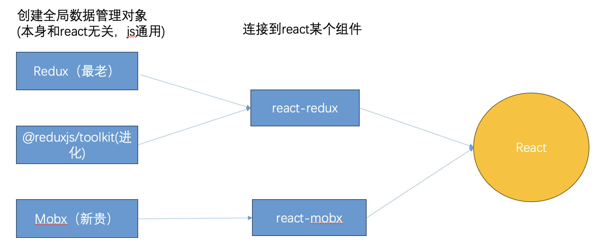

## 十五、React-router 使用

### 1、React-router 的三个版本

#### （1）React-router

服务端渲染使用

#### （2）React-router-dom

浏览器端渲染使用（常用）

#### （3）React-router-native

React-native 混合开发使用

### 2、React-router 使用步骤

（1）通过 BrowserRouter 或者 HashRouter 包裹要使用路由的根组件

（2）使用 Routes 组件，定义路由显示区域

（3）使用 Route 组件，定义具体路由规则

（4）使用 NavLink 或者 Link 组件，定义跳转链接

### 3、React-router 其他组件

（1）Navigate：路由重定向

（2）Outlet：嵌套路由的子路由显示处

### 4、获取路由参数

#### （1）Params 参数

- V5：useParams
- V6：this.props.match.params

#### （2）Query 参数

- V5：useSearchParams
- V6：this.props.location.search

#### （3）Location 信息

- V5：useLocation
- V6：this.props.location.state

### 5、js 控制跳转地址

- V6：useNavigate 创建跳转方法、然后跳转
- V5：this.props.history.push()

### 6、React 异步路由

React 做异步路由，要配合 React 的方法 lazy 和 组件 suspense

``` js
/* index.js */
import React from "react";
import ReactDOM from "react-dom/client";
import "./index.css";
import App from "./App";
import reportWebVitals from "./reportWebVitals";
import { BrowserRouter, HashRouter } from "react-router-dom";

const root = ReactDOM.createRoot(document.getElementById("root"));
root.render(
  <React.StrictMode>
    {/* history 模式，路径为 .../page1 */}
    <BrowserRouter>
      {/* hash 模式，路径为 .../#/page1 */}
      {/* <HashRouter> */}
      <App />
      {/* </HashRouter> */}
    </BrowserRouter>
  </React.StrictMode>
);
reportWebVitals();
```

``` js
/* App.js */
import "./App.css";
import { Routes, Route, NavLink, Link, Navigate } from "react-router-dom";
import Page1 from "./Page1";
import Page2 from "./Page2";
import Page3 from "./Page3";
import Page4 from "./Page4";
import Page2Son1 from "./Page2Son1";
import Page2Son2 from "./Page2Son2";

// 异步路由（懒加载）
import { lazy, Suspense } from "react";
let LazyPage4 = lazy(() => {
  return import("./Page4");
});

function App() {
  let _token = localStorage.getItem("token");
  return (
    <>
      {/* 菜单 */}
      <div>
        {/* NavLink 有 active 类 */}
        <NavLink to="/page1">page1</NavLink>
        <NavLink to="/page2">page2</NavLink>
        <NavLink to="/page3">page3</NavLink>
        <NavLink to="/page4">page4</NavLink>
        <NavLink to="/lazyPage4">lazyPage4</NavLink>

        {/* Link 没有 active 类 */}
        {/* <Link to="/page1">page1</Link>
        <Link to="/page2">page2</Link>
        <Link to="/page3">page3</Link>
        <Link to="/page4">page4</Link> */}
      </div>

      {/* React v5 和 v6 有较大的区别 */}
      {/* v5 是 switch，只有 Component */}
      {/* Routes 里只能放 Route，Route 也只能放到 Routes 里 */}
      <Suspense fallback={<h2>加载中</h2>}>
        <Routes>
          {/* 控制访问权限1：通过 navigate 跳转到其他页面 */}
          {/* <Route
          path="/page1"
          element={_token ? <Page1></Page1> : <Navigate to="/page4"></Navigate>}
        ></Route> */}
          {/* 控制访问权限2：直接不生成 */}
          <Route path="/page1" element={_token ? <Page1></Page1> : ""}></Route>
          <Route path="/page2" Component={Page2}>
            <Route path="son1" Component={Page2Son1}></Route>
            <Route path="son2" Component={Page2Son2}></Route>
          </Route>
          <Route path="/page3/:id" Component={Page3}></Route>
          <Route path="/page4" Component={Page4}></Route>
          <Route path="/lazyPage4" Component={LazyPage4}></Route>
        </Routes>
      </Suspense>
    </>
  );
}

export default App;
```

``` js
/* Page1.js */
// location 路径信息
import { useLocation } from "react-router-dom";

function Page1() {
  let location = useLocation();
  console.log("location", location);
  return <div>this is page1</div>;
}

export default Page1;
```

``` js
/* Page2.js */
import { Outlet, useNavigate } from "react-router-dom";

function Page2() {
  let nav = useNavigate()
  return (
    <>
      <div>this is page2</div>
      <button onClick={() => {
        nav("/page1?a=12345", {
          state: {
            msg: "state msg"
          }
        })
      }}>跳转到 page1</button>
      {/* 嵌套路由 */}
      <Outlet></Outlet>
    </>
  );
}

export default Page2;
```

``` js
/* Page2Son1.js */
function Page2Son1() {
  return <div>this is page2son1</div>;
}
export default Page2Son1;

```

``` js
/* Page2Son2.js */
function Page2Son2() {
  return <div>this is page2son2</div>;
}
export default Page2Son2;
```

``` js
/* Page3.js */
// ../page3?a=1&b=2 - Query 参数
// ../page3/123 - Param 参数
import { useParams } from "react-router-dom";

function Page3() {
  let params = useParams()
  console.log("params", params)
  return <div>this is page3</div>;
}

export default Page3;
```

``` js
/* Page4.js */
import { useSearchParams } from "react-router-dom";

function Page4() {
  let [searchParams, setSearchParams] = useSearchParams();
  console.log("searchParams.get('a')", searchParams.get("a"));
  // console.log("setSearchParams", setSearchParams)
  return (
    <>
      <div>this is page4</div>
      <button
        onClick={() => {
          setSearchParams({
            a: 888,
            b: 666,
          });
        }}
      >
        改变 search
      </button>
    </>
  );
}

export default Page4;
```

## 十六、React 状态管理

### 1、状态管理

（1）React 没有专门的状态管理库，只有通用的 JS 状态管理库，所以首先创建一个全局的数据储存和管理工具

（2）通过其他工具，数据修改能触发 React 页面更新

### 2、React 状态管理库



### 3、Redux

``` js
/* index.js */
import React from "react";
import ReactDOM from "react-dom/client";
import "./index.css";
import App from "./App";
import reportWebVitals from "./reportWebVitals";
import { Provider } from "react-redux";
import store from "./store/index";

const root = ReactDOM.createRoot(document.getElementById("root"));
// store.subscribe(() => {
//   root.render(
//     <React.StrictMode>
//       <App />
//     </React.StrictMode>
//   );
// });
root.render(
  <React.StrictMode>
    <Provider store={store}>
      <App />
    </Provider>
  </React.StrictMode>
);
reportWebVitals();
```

``` js
/* App.js */
import store from "./store/index";
// let state = store.getState();
import { connect } from "react-redux";

function App(props) {
  console.log("props", props);
  // console.log("state1", state);
  return (
    <>
      {/* <div>{state.msg}</div>
      <button
        onClick={() => {
          store.dispatch({
            type: "changeMsg",
            payload: "world",
          });
          console.log("state2", state);
        }}
      >
        修改 state
      </button> */}
      <div>{props.msg}</div>
      <button
        onClick={() => {
          console.log("store.getState()", store.getState());
          // props.dispatch({
          //   type: "changeMsg",
          //   payload: "world",
          // });
          props.changeMsg();
        }}
      >
        修改 state
      </button>
    </>
  );
}

// connect 第一个参数是 state 的映射，即需要把哪些 state 映射到该组件的 props 里
// connect 第二个参数是方法的映射，即需要给 props 加入的方法
let ReduxApp = connect(
  (state) => {
    console.log("state", state);
    // return state;
    return {
      msg: state.msgReducer.msg,
    };
  },
  (dispatch) => {
    return {
      // 把 dispatch 封装成 changeMsg
      changeMsg() {
        dispatch({
          type: "changeMsg",
          payload: "world",
        });
      },
    };
  }
)(App);

export default ReduxApp;
```

``` js
/* store/index.js */
import { legacy_createStore as createStore, combineReducers } from "redux";

function msgReducer(state = { msg: "hello" }, action) {
  // 具体修改数据的行为
  // 通常约定叫 type
  switch (action.type) {
    case "changeMsg":
      // 通常约定叫 payload
      state.msg = action.payload;
      // 最后一定要 return 并展开，解除引用
      return { ...state };
    case "resetMsg":
      state.msg = "hello";
      return { ...state };
    default:
      return state;
  }
}

function numReducer(state = { num: 0 }, action) {
  switch (action.type) {
    case "addNum":
      state.num++;
      return { ...state };
    default:
      return state;
  }
}

let reducer = combineReducers({
  msgReducer,
  numReducer,
});

let store = createStore(reducer);
export default store;
```

### 4、Redux-toolkit

#### （1）connect 方式

``` js
/* index.js */
import React from "react";
import ReactDOM from "react-dom/client";
import "./index.css";
import App from "./App";
import reportWebVitals from "./reportWebVitals";
import { Provider } from "react-redux";
import store from "./store/toolkitIndex";

const root = ReactDOM.createRoot(document.getElementById("root"));
root.render(
  <React.StrictMode>
    <Provider store={store}>
      <App />
    </Provider>
  </React.StrictMode>
);
reportWebVitals();
```

``` js
/* App.js */
import store from "./store/toolkitIndex";
import { connect } from "react-redux";
import { changeMsg, addNum } from "./store/toolkitIndex";

function App(props) {
  console.log("props", props);
  return (
    <>
      <div>{props.msg}</div>
      <div>{props.num}</div>
      <button
        onClick={() => {
          console.log("store.getState()", store.getState());
          props.changeMsg();
        }}
      >
        修改 state
      </button>
      <button
        onClick={() => {
          console.log("store.getState()", store.getState());
          props.addNum();
        }}
      >
        增加 num
      </button>
    </>
  );
}

// connect 第一个参数是 state 的映射，即需要把哪些 state 映射到该组件的 props 里
// connect 第二个参数是方法的映射，即需要给 props 加入的方法
let ReduxApp = connect(
  (state) => {
    console.log("state", state);
    return {
      msg: state.msgReducer.msg,
      num: state.numReducer.num,
    };
  },
  (dispatch) => {
    return {
      changeMsg() {
        // dispatch({
        //   type: "changeMsg",
        //   payload: "world",
        // });
        // toolkit 的触发方法
        dispatch(changeMsg("world"))
      },
      addNum() {
        // dispatch({
        //   type: "addNum",
        // });
        dispatch(addNum())
      },
    };
  }
)(App);

export default ReduxApp;
```

#### （2）hook 方式

``` js
/* App2.js */
// hook 方式只能用于 toolkit，只能用于 函数组件
import { useSelector, useDispatch } from "react-redux";
import { addNum } from "./store/toolkitIndex";

function App2() {
  // 取出 state
  let num = useSelector((state) => {
    console.log("state", state);
    return state.numReducer.num;
  });
  let dispatch = useDispatch()
  return (
    <>
      <div>{num}</div>
      <button onClick={()=> {
        // dispatch({
        //   type: "numSlice/addNum"
        // })
        dispatch(addNum())
      }}>增加</button>
    </>
  );
}

export default App2;
```

### 5、异步操作

``` js
/* toolkitIndex.js */
import {
  createSlice,
  configureStore,
  createAsyncThunk,
} from "@reduxjs/toolkit";

// 异步操作
// 第一个参数名字
// 第二个参数好似具体的异步操作
export let changeNumThunk = createAsyncThunk(
  "numSlice/changeNum",
  async (params) => {
    let res = await new Promise((resolve) => {
      console.log("params", params);
      setTimeout((state, action) => {
        resolve(999);
      }, 1000);
    });
    return res;
  }
);

let msgSlice = createSlice({
  name: "msgSlice",
  initialState: {
    msg: "hello",
  },
  reducers: {
    changeMsg(state, action) {
      state.msg = action.payload;
    },
  },
});

let numSlice = createSlice({
  name: "numSlice",
  initialState: {
    num: 0,
  },
  reducers: {
    addNum(state) {
      state.num++;
    },
  },
    extraReducers: (chunk) => {
      chunk
        .addCase(changeNumThunk.pending, () => {
          console.log("pending");
        })
        .addCase(changeNumThunk.fulfilled, (state, action) => {
          console.log("fulfilled");
          state.num = action.payload;
        });
    },
});

export let { changeMsg } = msgSlice.actions;
export let { addNum } = numSlice.actions;

let store = configureStore({
  reducer: {
    msgReducer: msgSlice.reducer,
    numReducer: numSlice.reducer,
  },
});

export default store;
```

``` js
/* App.js */
import store from "./store/toolkitIndex";
import { connect } from "react-redux";
import { changeMsg, addNum, changeNumThunk } from "./store/toolkitIndex";

function App(props) {
  console.log("props", props);
  return (
    <>
      <div>{props.msg}</div>
      <div>{props.num}</div>
      <button
        onClick={() => {
          console.log("store.getState()", store.getState());
          props.changeMsg();
        }}
      >
        修改 state
      </button>
      <button
        onClick={() => {
          console.log("store.getState()", store.getState());
          props.addNum();
        }}
      >
        增加 num
      </button>
      <button
        onClick={() => {
          props.changeNumThunk();
        }}
      >
        异步修改
      </button>
    </>
  );
}

// connect 第一个参数是 state 的映射，即需要把哪些 state 映射到该组件的 props 里
// connect 第二个参数是方法的映射，即需要给 props 加入的方法
let ReduxApp = connect(
  (state) => {
    console.log("state", state);
    return {
      msg: state.msgReducer.msg,
      num: state.numReducer.num,
    };
  },
  (dispatch) => {
    return {
      changeMsg() {
        // dispatch({
        //   type: "changeMsg",
        //   payload: "world",
        // });
        // toolkit 的触发方法
        dispatch(changeMsg("world"));
      },
      addNum() {
        // dispatch({
        //   type: "addNum",
        // });
        dispatch(addNum());
      },
      changeNumThunk() {
        dispatch(changeNumThunk(1));
      },
    };
  }
)(App);

export default ReduxApp;
```

## 十七、React 路由权限控制

``` js
/* index.js */
import React from "react";
import ReactDOM from "react-dom/client";
import "./index.css";
import App from "./App";
import reportWebVitals from "./reportWebVitals";
import { BrowserRouter } from "react-router-dom";

const root = ReactDOM.createRoot(document.getElementById("root"));
root.render(
  // <React.StrictMode>
  <BrowserRouter>
    <App />
  </BrowserRouter>
  // </React.StrictMode>
);

reportWebVitals();
```

``` js
/* App.js */
import { Routes } from "react-router-dom";
import { createRoute } from "./router/createRoute";
import routerArr from "./router/routerArr";

function App() {
  console.log("createRoute(routerArr)", createRoute(routerArr));
  return (
    <>
      <Routes>{createRoute(routerArr)}</Routes>
    </>
  );
}

export default App;
```

``` js
/* createRoute.js */
import { Route } from "react-router-dom";

export function createRoute(routerArr, parentPath = "") {
  return routerArr.map((item) => {
    // 生成唯一的 key
    const uniqueKey = parentPath ? `${parentPath}-${item.path}` : item.path;

    if (item.children && item.children.length > 0) {
      return (
        <Route key={uniqueKey} path={item.path} element={<item.component />}>
          {createRoute(item.children, item.path)}
        </Route>
      );
    } else {
      return (
        <Route key={uniqueKey} path={item.path} element={<item.component />} />
      );
    }
  });
}
```

``` js
/* routerArr.js */
import Page1 from "../Page1";
import Page2 from "../Page2";
import Page3 from "../Page3";
import Page2Son1 from "../Page2Son1";
import Page2Son2 from "../Page2Son2";

export default [
  {
    path: "/page1",
    component: Page1,
  },
  {
    path: "/page2",
    component: Page2,
    children: [
      {
        path: "son1",
        component: Page2Son1,
      },
      {
        path: "son2",
        component: Page2Son2,
      },
    ],
  },
  {
    path: "/page3",
    component: Page3,
  },
];
```

## 十八、组件库等相关生态

### 1、React 组件库

最常用：PC 端 - Ant Design，移动端 - Ant Design Mobile

``` js
/* index.js */
import React from "react";
import ReactDOM from "react-dom/client";
import "./index.css";
import App from "./App";
import reportWebVitals from "./reportWebVitals";
import { ConfigProvider } from "antd";

const root = ReactDOM.createRoot(document.getElementById("root"));
root.render(
  <React.StrictMode>
    <ConfigProvider
      theme={{
        token: {
          colorPrimary: "#666",
        },
      }}
    >
      <App />
    </ConfigProvider>
  </React.StrictMode>
);

reportWebVitals();
```

``` js
/* App.js */
import { Button } from "antd";
import { Table } from "antd";
import { useMemo } from "react";

function App() {
  let arr = [
    {
      id: 0,
      name: "name1",
      status: 0,
    },
    {
      id: 1,
      name: "name2",
      status: 1,
    },
    {
      id: 2,
      name: "name3",
      status: 0,
    },
  ];
  let columns = useMemo(() => {
    return [
      {
        title: "名字",
        dataIndex: "name",
      },
      {
        title: "状态",
        dataIndex: "status",
        render(status) {
          console.log("status1", status); // 0 1 2
          return <>{status === 0 ? <span>在校</span> : <span>已休学</span>}</>;
        },
      },
      {
        title: "操作",
        render(status) {
          console.log("status2", status); // 没有 dataIndex，整列数据
          return (
            <>
              <Button type="primary">增加</Button>
              <Button>删除</Button>
            </>
          );
        },
      },
    ];
  });
  return (
    <>
      <Button>按钮</Button>
      <Table columns={columns} dataSource={arr} rowKey="id"></Table>
    </>
  );
}

export default App;
```

### 2、应用框架

最常用：umi

``` shell
npm i pnpm -g

pnpm dix create-umi@latest
```
