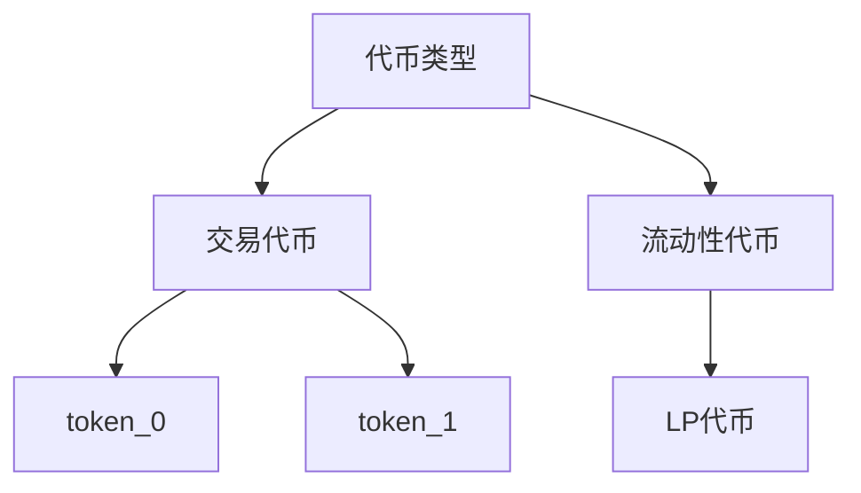
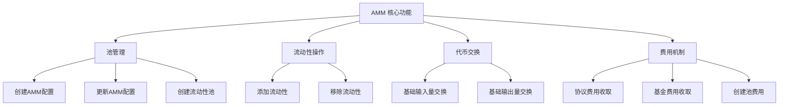

[Codes in lesson7](https://github.com/Zoella-w/IB-Solana/tree/main/7_swap)

## AMM 原理 - 代币

在 AMM（自动做市商）池中，token_0、token_1 和 LP 这三种代币构成了流动性池的核心经济模型：



### token_0、token_1（交易代币）

#### 核心作用

​​- 交易媒介​​：用户用来交换的代币（如 SOL/USDC 对中的 SOL 和 USDC）
​​- 流动性基础​​：组成交易对的基础资产
​​- 价值储存​​：代表实际资产价值

#### 关键特性对比

```plaintext
#[account(constraint = token_0_mint.key() < token_1_mint.key())]
```

- ​强制要求​​：token_0 的地址必须小于 token_1 的地址
- ​比较方式​​：按字节顺序比较公钥（Pubkey）
- 结果​​：确保每个代币对只有唯一的排序方式

### LP 代币（流动性提供者代币）

#### 核心作用

​- ​流动性证明​​：代表用户在池中的份额
​​- 权益凭证​​：持有者有权获得交易手续费分成
​​- 可交易资产​​：可在二级市场交易

#### 关键特性

| 特性  | 说明 |
| -- | -- |
| 发行机制​​ | 铸造给流动性提供者 |
| 价值基础​​ | 基于池中资产价值 |
| 小数位​​ | 固定9位小数（如 1.000000000） |
| 控制权​​ | 由程序PDA控制铸造/销毁 |

#### 经济模型

```plaintext
LP 代币价值 = (池中 token_0 总值 + 池中 token_1 总值) / LP 总供应量
```

## AMM 原理 - 角色

### 核心操作账户

| 账户 | 类型 | 作用 | 关键特性
| -- | -- | -- | -- |
| ​​创建者（`creator`） | 签名账户 | 支付费用并提供初始流动性 | 必须签名，支付所有费用 |
| ​​权限账户（`authority`） | PDA | 池的管理员，执行代币操作 | 程序控制，安全签名 |
| ​​AMM 配置（`amm_config`） | 状态账户 | 存储全局参数（如费率） | 只读，定义池规则 |​

### 代币相关账户

| 账户 | 类型 | 作用 | 关键特性 |
| -- | -- | -- | -- |
|​​ token_0 铸币（`token_0_mint`）​ | 铸币账户 | 定义 token_0 的属性	| 地址必须 <  token_1  |
|​​ token_1 铸币（`token_1_mint`）​ | 铸币账户 | 定义 token_1 的属性	| 地址必须 >  token_0  |
|​ LP 铸币（`lp_mint`）​​ | PDA 铸币 | 创建 LP 代币 | 固定9位小数，代表流动性份额 |
| 创建者 token_0 账户​​ | 代币账户 | 创建者的 token_0 余额 | 提供初始流动性 |
| 创建者 token_1 账户​​ | 代币账户 | 创建者的 token_1 余额 | 提供初始流动性 |
| 创建者 LP 账户​​ | 关联代币账户 | 接收 LP 代币 | 自动创建 |

### 池资产账户

| 账户 | 类型 | 作用 | 关键特性 |
| -- | -- | -- | -- |
| ​token_0 金库（`token_0_vault`） | PDA | 存储池中的​ token_0 | 由权限账户控制 |
| ​token_1 金库（`token_1_vault`）​ | PDA | 存储池中的 ​token_1 | 由权限账户控制 |
| 费用接收账户​​​​ | 固定地址 | 接收创建池费用 | 预定义地址 |

### 状态记录账户

| 账户 | 类型 | 作用 | 关键特性 |
| -- | -- | -- | -- |
| ​​池状态（`pool_state`） | 状态账户 | 记录池的核心数据 | 存储余额/费率/状态等 |
| ​​预言机状态（`observation_state`）​ | PDA | 记录价格历史 | 支持时间加权平均价 |

### 程序依赖

| 程序 | 作用 |
| -- | -- |
| ​​代币程序 |​​ 处理标准 SPL 代币 |
| ​​Token2022 程序​​ | 处理扩展代币 |
| ​​关联代币程序​​ | 创建关联账户 |
| 系统程序​​​​ | 创建账户和转账 SOL |

## AMM 原理 - 协议费和基金费

### 协议费用（Protocol Fee）
​​
协议费用 是 交易手续费中分配给协议开发团队或协议国库的部分。这部分费用用于支持协议的持续开发、维护和运营

#### ​​用途​​

- ​​协议开发​​：支付开发团队工资，支持新功能研发
​- ​安全审计​​：资助智能合约安全审计
​​- 漏洞赏金​​：激励白帽黑客发现并报告漏洞
​​- 基础设施​​：维护服务器、节点等基础设施
​​- 法律合规​​：处理法律和合规事务

#### ​​经济模型特点​​

- 通常为交易额的 0.01%-0.05%
- 从每笔交易的手续费中抽取
- 累积在池中，由协议定期收取
- 通常以交易对中的基础代币（如稳定币）形式存在

### 基金费用（Fund Fee）
​​
基金费用是交易手续费中分配给生态系统发展基金的部分。这部分费用用于支持协议的长期发展和生态建设

#### ​​用途​​

- ​​流动性激励​​：奖励流动性提供者（额外激励）
​​- 社区建设​​：资助社区活动、教育项目
​​- 合作伙伴关系​​：与其他协议合作的市场活动
​​- 代币回购与销毁​​：维护代币经济模型
​​- 战略投资​​：投资生态内优质项目
​
#### ​经济模型特点​​

- 通常为交易额的 0.01%-0.03%
- 与协议费用分开管理
- 可能通过 DAO 治理决定用途
- 通常以协议原生代币或交易对代币形式收取

## 程序功能概述

这是一个基于 Solana 的恒定乘积自动做市商 (AMM) 程序，属于 Raydium 生态系统的一部分。程序实现了以下核心功能：



## 角色

### Admin

- `create_amm_config`：创建 AMM 配置
- `update_amm_config`：更新 AMM 配置
- `update_pool_status`：更新流动池的状态
- `collect_protocol_fee`：收取流动池中累积的协议费
- `collecr_fund_fee`：收取流动池中累积的基金费

### User

- `initialize`：创建流动池
- `deposit`：存钱-增加流动性
- `withdraw`：提现-减少流动性
- `swap_base_input`：基于输入数量的代币交换
- `swap_base_output`：基于输出数量的代币交换

## 调用顺序

### `create_amm_config`

- 管理员部署程序时调用，设置全局费率和规则
- 前端显示配置表单，提交后调用

### `initialize`

- 用户创建新流动性池，设置初始流动性
- 前端提供代币选择和数量输入界面

### `deposit`

- 用户增加流动性，获取 LP 代币
- 前端显示当前流动性池状态，计算并显示所需代币数量

### `swap_base_input` & `swap_base_output`

- 用户进行交易
- 前端提供交易输入框，实时计算输出并显示滑点

### `withdraw`

- 用户提取流动性
- 前端显示用户持有的 LP 代币，计算可提取的代币数量

### `collect_protocol_fee` & `collect_fund_fee`

- 管理员提取费用
- 前端提供管理界面，显示累积费用并允许提取

### `update_amm_config` & `update_pool_status`

- 管理员调整参数或状态
- 前端提供管理界面，允许更新

## AMM 曲线计算模块

### 核心功能详解

#### 基础工具函数 `map_zero_to_none`

```rust
pub fn map_zero_to_none(x: u128) -> Option<u128> {
    if x == 0 {
        None
    } else {
        Some(x)
    }
}
```

​​作用​​：将零值转换为 None

​​用途​​：防止除零错误

​​示例​​：
- 输入 0 → None
- 输入 100 → Some(100)

#### 交易方向枚举 `TradeDirection`

```rust
#[derive(Clone, Copy, Debug, PartialEq)]
pub enum TradeDirection {
    ZeroForOne, // 用 token_0 换 token_1
    OneForZero, // 用 token_1 换 token_0
}
```

关键方法：
```rust
impl TradeDirection {
    pub fn opposite(&self) -> TradeDirection {
        match self {
            TradeDirection::ZeroForOne => TradeDirection::OneForZero,
            TradeDirection::OneForZero => TradeDirection::ZeroForOne,
        }
    }
}
```

​​作用​​：获取相反交易方向

​​示例​​：`ZeroForOne.opposite() = OneForZero`

#### 取整方向枚举 `RoundDirection`

```rust
#[repr(C)]
#[derive(Clone, Copy, Debug, PartialEq)]
pub enum RoundDirection {
    Floor,   // 向下取整
    Ceiling, // 向上取整
}
```

​​用途​​：控制流动性计算时的取整方式

​​场景​​：
- Floor：移除流动性时保护池
- Ceiling：添加流动性时保护用户

#### 计算结果结构

1. `TradingTokenResult`

```rust
#[derive(Debug, PartialEq)]
pub struct TradingTokenResult {
    pub token_0_amount: u128,
    pub token_1_amount: u128,
}
```

​​作用​​：存储流动性转换结果

​​场景​​：添加/移除流动性时计算代币数量

2. `SwapResult`

```rust
#[derive(Debug, PartialEq)]
pub struct SwapResult {
    pub new_swap_source_amount: u128,
    pub new_swap_destination_amount: u128,
    pub source_amount_swapped: u128,
    pub destination_amount_swapped: u128,
    pub trade_fee: u128,
    pub protocol_fee: u128,
    pub fund_fee: u128,
}
```

​​字段说明​​：
- `new_swap_source_amount`：交换后源代币新余额
- `new_swap_destination_amount`：交换后目标代币新余额
- `source_amount_swapped`：实际交换的源代币数量
- `destination_amount_swapped`：实际交换的目标代币数量
- `trade_fee`：交易手续费
- `protocol_fee`：协议费用
- `fund_fee`：基金费用

#### 核心计算逻辑 `CurveCalculator` 结构体

```rust
#[derive(Clone, Debug, Default, PartialEq)]
pub struct CurveCalculator {}
```

关键方法：

1. 供应量验证 `validate_supply`

```rust
pub fn validate_supply(token_0_amount: u64, token_1_amount: u64) -> Result<()> {
    if token_0_amount == 0 {
        return Err(ErrorCode::EmptySupply.into());
    }
    if token_1_amount == 0 {
        return Err(ErrorCode::EmptySupply.into());
    }
    Ok(())
}
```

​​作用​​：确保池中两种代币都有余额

​​错误​​：`EmptySupply` 如果任一余额为零

2. 固定输入量交换 `swap_base_input`

```rust
pub fn swap_base_input(
    source_amount: u128,
    swap_source_amount: u128,
    swap_destination_amount: u128,
    trade_fee_rate: u64,
    protocol_fee_rate: u64,
    fund_fee_rate: u64,
) -> Option<SwapResult> {
    // 1. 计算各类费用
    let trade_fee = Fees::trading_fee(source_amount, trade_fee_rate)?;
    let protocol_fee = Fees::protocol_fee(trade_fee, protocol_fee_rate)?;
    let fund_fee = Fees::fund_fee(trade_fee, fund_fee_rate)?;
    // 2. 扣除费用后的实际输入量
    let source_amount_less_fees = source_amount.checked_sub(trade_fee)?;
    // 3. 计算交换结果（基于恒定乘积公式）
    let destination_amount_swapped = ConstantProductCurve::swap_base_input_without_fees(
        source_amount_less_fees,
        swap_source_amount,
        swap_destination_amount,
    );
    // 4. 返回计算结果
    Some(SwapResult {
        new_swap_source_amount: swap_source_amount.checked_add(source_amount)?,
        new_swap_destination_amount: swap_destination_amount
            .checked_sub(destination_amount_swapped)?,
        source_amount_swapped: source_amount,
        destination_amount_swapped,
        trade_fee,
        protocol_fee,
        fund_fee,
    })
}
```

3. 固定输出量交换 `swap_base_output`

```rust
pub fn swap_base_output(
    destination_amount: u128,
    swap_source_amount: u128,
    swap_destination_amount: u128,
    trade_fee_rate: u64,
    protocol_fee_rate: u64,
    fund_fee_rate: u64,
) -> Option<SwapResult> {
    // 1. 计算所需输入量（不含费用）
    let source_amount_swapped = ConstantProductCurve::swap_base_output_without_fees(
        destination_amount,
        swap_source_amount,
        swap_destination_amount,
    );
    // 2. 计算含费用的总输入量
    let source_amount = Fees::calculate_pre_fee_amount(source_amount_swapped, trade_fee_rate)?;
    let trade_fee = Fees::trading_fee(source_amount, trade_fee_rate)?;
    let protocol_fee = Fees::protocol_fee(trade_fee, protocol_fee_rate)?;
    let fund_fee = Fees::fund_fee(trade_fee, fund_fee_rate)?;
    // 3. 返回计算结果
    Some(SwapResult {
        new_swap_source_amount: swap_source_amount.checked_add(source_amount)?,
        new_swap_destination_amount: swap_destination_amount
            .checked_sub(destination_amount)?,
        source_amount_swapped: source_amount,
        destination_amount_swapped: destination_amount,
        trade_fee,
        protocol_fee,
        fund_fee,
    })
}
```

4. LP 代币转换 `lp_tokens_to_trading_tokens`

```rust
pub fn lp_tokens_to_trading_tokens(
    lp_token_amount: u128,
    lp_token_supply: u128,
    swap_token_0_amount: u128,
    swap_token_1_amount: u128,
    round_direction: RoundDirection,
) -> Option<TradingTokenResult> {
    ConstantProductCurve::lp_tokens_to_trading_tokens(
        lp_token_amount,
        lp_token_supply,
        swap_token_0_amount,
        swap_token_1_amount,
        round_direction,
    )
}
```

​​公式​​：
`token0_amount = (lp_token_amount / lp_token_supply) * swap_token_0_amount`
`token1_amount = (lp_token_amount / lp_token_supply) * swap_token_1_amount`

​​取整方向​​：
- Floor：移除流动性时使用，保护池
- Ceiling：添加流动性时使用，保护用户

#### 测试工具模块

核心测试函数：

1. 标准化价值计算 `normalized_value`

```rust
pub fn normalized_value(
    swap_token_a_amount: u128,
    swap_token_b_amount: u128,
) -> Option<PreciseNumber> {
    let swap_token_a_amount = PreciseNumber::new(swap_token_a_amount)?;
    let swap_token_b_amount = PreciseNumber::new(swap_token_b_amount)?;
    swap_token_a_amount
        .checked_mul(&swap_token_b_amount)?
        .sqrt()
}
```

​​作用​​：计算池的标准化价值（几何平均数）

​​公式​​：`√(token_a * token_b)`

2. 交换价值验证 `check_curve_value_from_swap`

```rust
pub fn check_curve_value_from_swap(
    source_token_amount: u128,
    swap_source_amount: u128,
    swap_destination_amount: u128,
    trade_direction: TradeDirection,
) {
    // 计算交换结果
    let destination_amount_swapped = ...;
    // 计算交换前后的常数乘积
    let previous_value = swap_token_0_amount * swap_token_1_amount;
    let new_value = new_swap_token_0_amount * new_swap_token_1_amount;
    // 验证新值不小于原值
    assert!(new_value >= previous_value);
}
```

​​目的​​：确保交换不会减少池的总价值

​​原理​​：常数乘积 k 应增加或保持不变

3. 流动性操作价值验证 `check_pool_value_from_deposit`

```rust
pub fn check_pool_value_from_deposit(...) {
    // 验证存款不会稀释 LP 代币价值
}
pub fn check_pool_value_from_withdraw(...) {
    // 验证取款不会增加剩余 LP 代币价值
}
```

​​数学原理​​：
- 存款后：`new_token_a / new_pool_token_supply >= token_a / pool_token_supply`
- 取款后：`new_value / new_pool_token_supply >= value / pool_token_supply`

4. 属性测试生成器 `total_and_intermediate`

```rust
prop_compose! {
    pub fn total_and_intermediate(max_value: u64)(total in 1..max_value)
                    (intermediate in 1..total, total in Just(total))
                    -> (u64, u64) {
        (total, intermediate)
    }
}
```

​​作用​​：生成测试用的总量和中间值

​​用途​​：测试部分存款/取款场景

### 恒定乘积曲线实现

核心公式：

```rust
// 固定输入量交换
pub fn swap_base_input_without_fees(
    source_amount: u128,
    swap_source_amount: u128,
    swap_destination_amount: u128,
) -> u128 {
    // 恒定乘积公式
    let invariant = swap_source_amount.checked_mul(swap_destination_amount).unwrap();
    let new_source_amount = swap_source_amount.checked_add(source_amount).unwrap();
    swap_destination_amount.checked_sub(invariant / new_source_amount).unwrap()
}

// 固定输出量交换
pub fn swap_base_output_without_fees(
    destination_amount: u128,
    swap_source_amount: u128,
    swap_destination_amount: u128,
) -> u128 {
    let invariant = swap_source_amount.checked_mul(swap_destination_amount).unwrap();
    let new_destination_amount = swap_destination_amount.checked_sub(destination_amount).unwrap();
    (invariant / new_destination_amount).checked_sub(swap_source_amount).unwrap()
}

// LP 代币转换
pub fn lp_tokens_to_trading_tokens(
    lp_token_amount: u128,
    lp_token_supply: u128,
    swap_token_0_amount: u128,
    swap_token_1_amount: u128,
    round_direction: RoundDirection,
) -> Option<TradingTokenResult> {
    // 计算比例
    let token_0_amount = lp_token_amount
        .checked_mul(swap_token_0_amount)?
        .checked_div(lp_token_supply)?;
    let token_1_amount = lp_token_amount
        .checked_mul(swap_token_1_amount)?
        .checked_div(lp_token_supply)?;
    // 根据方向取整
    let (token_0_amount, token_1_amount) = match round_direction {
        RoundDirection::Floor => (token_0_amount, token_1_amount),
        RoundDirection::Ceiling => {
            let token_0_remainder = lp_token_amount
                .checked_mul(swap_token_0_amount)?
                .checked_rem(lp_token_supply)?;
            let token_1_remainder = lp_token_amount
                .checked_mul(swap_token_1_amount)?
                .checked_rem(lp_token_supply)?;
            (
                token_0_amount + if token_0_remainder > 0 { 1 } else { 0 },
                token_1_amount + if token_1_remainder > 0 { 1 } else { 0 },
            )
        }
    };
    Some(TradingTokenResult {
        token_0_amount,
        token_1_amount,
    })
}
```

### 费用计算模块

```rust
mod Fees {
    // 计算交易费
    pub fn trading_fee(amount: u128, fee_rate: u64) -> Option<u128> {
        amount
            .checked_mul(u128::from(fee_rate))?
            .checked_div(FEE_DENOMINATOR)
    }
    
    // 计算协议费
    pub fn protocol_fee(trade_fee: u128, protocol_fee_rate: u64) -> Option<u128> {
        trade_fee
            .checked_mul(u128::from(protocol_fee_rate))?
            .checked_div(FEE_DENOMINATOR)
    }
    
    // 计算基金费
    pub fn fund_fee(trade_fee: u128, fund_fee_rate: u64) -> Option<u128> {
        trade_fee
            .checked_mul(u128::from(fund_fee_rate))?
            .checked_div(FEE_DENOMINATOR)
    }
    
    // 根据净额计算总金额（含费）
    pub fn calculate_pre_fee_amount(post_fee_amount: u128, fee_rate: u64) -> Option<u128> {
        let numerator = post_fee_amount.checked_mul(FEE_DENOMINATOR)?;
        let denominator = FEE_DENOMINATOR.checked_sub(u128::from(fee_rate))?;
        numerator.checked_div(denominator)
    }
}
```
