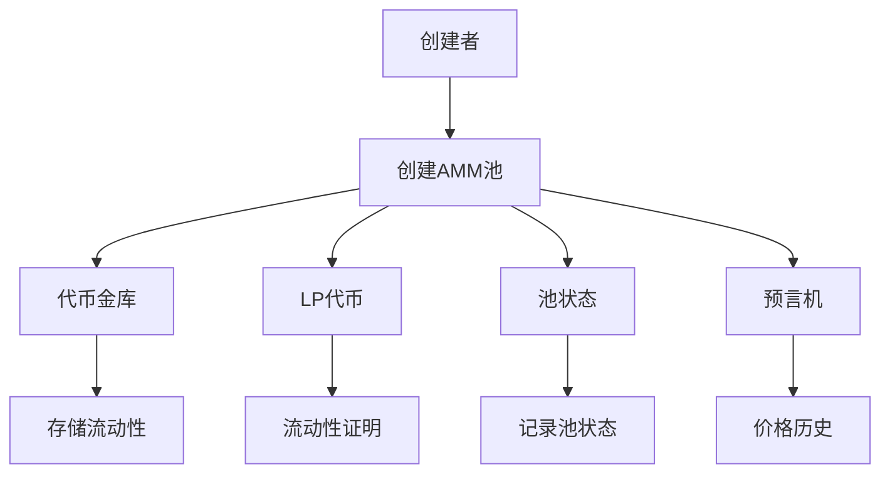
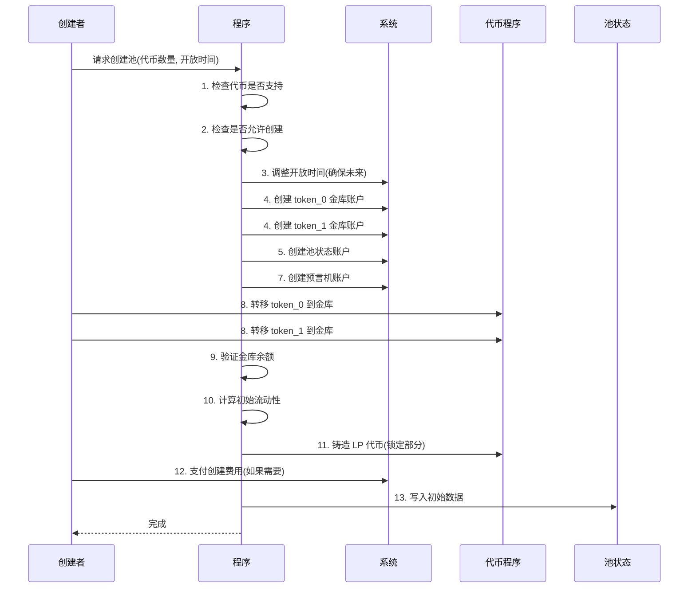

[Codes in lesson7](https://github.com/Zoella-w/IB-Solana/tree/main/7_swap)


## User 命令详解（`initialize` & `deposit` & `withdraw`）

### `initialize`（创建流动池）

src/instructions/lib.rs：
```rust
pub fn initialize(
    ctx: Context<Initialize>,
    init_amount_0: u64,
    init_amount_1: u64,
    open_time: u64,
) -> Result<()> {
    instructions::initialize(ctx, init_amount_0, init_amount_1, open_time)
}
```

src/instructions/admin/initialize.rs：
```rust
#[derive(Accounts)]
pub struct Initialize<'info> {
    /// 池创建者：支付创建费用的账户
    #[account(mut)]
    pub creator: Signer<'info>,

    /// AMM 配置账户：包含池参数和所有者信息
    pub amm_config: Box<Account<'info, AmmConfig>>,

    /// 池权限账户（PDA）：用于签名代币操作
    #[account(
        seeds = [crate::AUTH_SEED.as_bytes()],
        bump,
    )]
    pub authority: UncheckedAccount<'info>,

    /// 池状态账户：存储池的核心状态
    #[account(mut)]
    pub pool_state: UncheckedAccount<'info>,

    /// token_0 铸币账户：地址必须小于 token_1
    #[account(
        constraint = token_0_mint.key() < token_1_mint.key(),
        mint::token_program = token_0_program,
    )]
    pub token_0_mint: Box<InterfaceAccount<'info, Mint>>,

    /// token_1 铸币账户：地址必须大于 token_0 
    #[account(
        mint::token_program = token_1_program,
    )]
    pub token_1_mint: Box<InterfaceAccount<'info, Mint>>,

    /// LP 代币铸币账户：代表流动性提供者份额
    #[account(
        init,
        seeds = [POOL_LP_MINT_SEED.as_bytes(), pool_state.key().as_ref()],
        bump,
        mint::decimals = 9, // LP 代币固定9位小数
        mint::authority = authority, // PDA 控制
        payer = creator, // 创建者支付租金
        mint::token_program = token_program,
    )]
    pub lp_mint: Box<InterfaceAccount<'info, Mint>>,

    /// 创建者的 token_0 账户
    #[account(
        mut,
        token::mint = token_0_mint,
        token::authority = creator,
    )]
    pub creator_token_0: Box<InterfaceAccount<'info, TokenAccount>>,

    /// 创建者的 token_1 账户
    #[account(
        mut,
        token::mint = token_1_mint,
        token::authority = creator,
    )]
    pub creator_token_1: Box<InterfaceAccount<'info, TokenAccount>>,

    /// 创建者的 LP 代币账户（自动创建）
    #[account(
        init,
        associated_token::mint = lp_mint,
        associated_token::authority = creator,
        payer = creator,
        token::token_program = token_program,
    )]
    pub creator_lp_token: Box<InterfaceAccount<'info, TokenAccount>>,

    /// token_0 金库账户（PDA）
    #[account(
        mut,
        seeds = [
            POOL_VAULT_SEED.as_bytes(),
            pool_state.key().as_ref(),
            token_0_mint.key().as_ref()
        ],
        bump,
    )]
    pub token_0_vault: UncheckedAccount<'info>,

    /// token_1 金库账户（PDA）
    #[account(
        mut,
        seeds = [
            POOL_VAULT_SEED.as_bytes(),
            pool_state.key().as_ref(),
            token_1_mint.key().as_ref()
        ],
        bump,
    )]
    pub token_1_vault: UncheckedAccount<'info>,

    /// 创建池费用接收账户
    #[account(
        mut,
        address= crate::create_pool_fee_reveiver::ID,
    )]
    pub create_pool_fee: Box<InterfaceAccount<'info, TokenAccount>>,

    /// 预言机观测状态账户
    #[account(
        init,
        seeds = [OBSERVATION_SEED.as_bytes(), pool_state.key().as_ref()],
        bump,
        payer = creator,
        space = ObservationState::LEN
    )]
    pub observation_state: AccountLoader<'info, ObservationState>,

    // 程序依赖
    pub token_program: Program<'info, Token>,
    pub token_0_program: Interface<'info, TokenInterface>,
    pub token_1_program: Interface<'info, TokenInterface>,
    pub associated_token_program: Program<'info, AssociatedToken>,
    pub system_program: Program<'info, System>,
    pub rent: Sysvar<'info, Rent>,
}

// 初始化函数
pub fn initialize(
    ctx: Context<Initialize>,
    init_amount_0: u64, // 初始 token_0 数量
    init_amount_1: u64, // 初始 token_1 数量
    mut open_time: u64, // 池开放时间
) -> Result<()> {
    // 1. 验证代币支持性
    if !(is_supported_mint(&ctx.accounts.token_0_mint).unwrap()
        && is_supported_mint(&ctx.accounts.token_1_mint).unwrap())
    {
        return err!(ErrorCode::NotSupportMint);
    }
    // 2. 检查池创建是否被禁用
    if ctx.accounts.amm_config.disable_create_pool {
        return err!(ErrorCode::NotApproved);
    }
    // 3. 调整开放时间（确保在未来）
    let block_timestamp = clock::Clock::get()?.unix_timestamp as u64;
    if open_time <= block_timestamp {
        open_time = block_timestamp + 1;
    }
    // 4. 创建代币金库账户
    create_token_account(
        &ctx.accounts.authority.to_account_info(),
        &ctx.accounts.creator.to_account_info(),
        &ctx.accounts.token_0_vault.to_account_info(),
        &ctx.accounts.token_0_mint.to_account_info(),
        &ctx.accounts.system_program.to_account_info(),
        &ctx.accounts.token_0_program.to_account_info(),
        &[
            POOL_VAULT_SEED.as_bytes(),
            ctx.accounts.pool_state.key().as_ref(),
            ctx.accounts.token_0_mint.key().as_ref(),
            &[ctx.bumps.token_0_vault][..],
        ],
    )?;
    // 同样创建 token_1 金库账户（代码类似）
    // 5. 创建池状态账户
    let pool_state_loader = create_pool(
        &ctx.accounts.creator.to_account_info(),
        &ctx.accounts.pool_state.to_account_info(),
        &ctx.accounts.amm_config.to_account_info(),
        &ctx.accounts.token_0_mint.to_account_info(),
        &ctx.accounts.token_1_mint.to_account_info(),
        &ctx.accounts.system_program.to_account_info(),
    )?;
    // 6. 初始化池状态
    let pool_state = &mut pool_state_loader.load_init()?;
    // 7. 初始化预言机状态
    let mut observation_state = ctx.accounts.observation_state.load_init()?;
    observation_state.pool_id = ctx.accounts.pool_state.key();
    // 8. 转移初始流动性
    transfer_from_user_to_pool_vault(
        ctx.accounts.creator.to_account_info(),
        ctx.accounts.creator_token_0.to_account_info(),
        ctx.accounts.token_0_vault.to_account_info(),
        ctx.accounts.token_0_mint.to_account_info(),
        ctx.accounts.token_0_program.to_account_info(),
        init_amount_0,
        ctx.accounts.token_0_mint.decimals,
    )?;
    // 同样转移 token_1（代码类似）
    // 9. 验证金库余额
    let token_0_vault = /* 解析 token_0 金库余额 */;
    let token_1_vault = /* 解析 token_1 金库余额 */;
    CurveCalculator::validate_supply(token_0_vault.amount, token_1_vault.amount)?;
    // 10. 计算初始流动性
    let liquidity = U128::from(token_0_vault.amount)
        .checked_mul(token_1_vault.amount.into())
        .unwrap()
        .integer_sqrt()
        .as_u64();
    // 11. 铸造 LP 代币（锁定部分）
    let lock_lp_amount = 100; // 锁定 100个 LP 代币
    token::token_mint_to(
        ctx.accounts.authority.to_account_info(),
        ctx.accounts.token_program.to_account_info(),
        ctx.accounts.lp_mint.to_account_info(),
        ctx.accounts.creator_lp_token.to_account_info(),
        liquidity.checked_sub(lock_lp_amount).unwrap(),
        &[&[crate::AUTH_SEED.as_bytes(), &[ctx.bumps.authority]]],
    )?;
    // 12. 支付创建池费用
    if ctx.accounts.amm_config.create_pool_fee != 0 {
        // 转账费用
        invoke(
            &system_instruction::transfer(
                ctx.accounts.creator.key,
                &ctx.accounts.create_pool_fee.key(),
                ctx.accounts.amm_config.create_pool_fee,
            ),
            &[ctx.accounts.creator.to_account_info(), /*...*/],
        )?;
        // 如果是原生代币，同步余额
        invoke(
            &spl_token::instruction::sync_native(/*...*/)?,
            &[/*...*/],
        )?;
    }
    // 13. 完成池初始化
    pool_state.initialize(
        ctx.bumps.authority, // PDA bump 值
        liquidity, // 初始流动性
        open_time, // 开放时间
        ctx.accounts.creator.key(), // 创建者
        ctx.accounts.amm_config.key(), // 配置账户
        ctx.accounts.token_0_vault.key(), //  token_0 金库
        ctx.accounts.token_1_vault.key(), //  token_1 金库
        &ctx.accounts.token_0_mint, //  token_0 铸币
        &ctx.accounts.token_1_mint, //  token_1 铸币
        &ctx.accounts.lp_mint, // LP 铸币
        ctx.accounts.observation_state.key(), // 预言机状态
    );
    Ok(())
}

// 创建流动池账户
pub fn create_pool<'info>(
    payer: &AccountInfo<'info>,
    pool_account_info: &AccountInfo<'info>,
    amm_config: &AccountInfo<'info>,
    token_0_mint: &AccountInfo<'info>,
    token_1_mint: &AccountInfo<'info>,
    system_program: &AccountInfo<'info>,
) -> Result<AccountLoad<'info, PoolState>> {
    // 验证账户所有权
    if pool_account_info.owner != &system_program::ID {
        return err!(ErrorCode::NotApproved);
    }
    // 计算预期 PDA 地址
    let (expect_pda_address, bump) = Pubkey::find_program_address(
        &[
            POOL_SEED.as_bytes(),
            amm_config.key().as_ref(),
            token_0_mint.key().as_ref(),
            token_1_mint.key().as_ref(),
        ],
        &crate::id(),
    );
    // 处理非 PDA 情况
    if pool_account_info.key() != expect_pda_address {
        require_eq!(pool_account_info.is_signer, true); // 必须签名
    }
    // 创建账户
    token::create_or_allocate_account(
        &crate::id(),
        payer,
        system_program,
        pool_account_info.clone(),
        &[
            POOL_SEED.as_bytes(),
            amm_config.key().as_ref(),
            token_0_mint.key().as_ref(),
            token_1_mint.key().as_ref(),
            &[bump],
        ],
        PoolState::LEN,
    )?;
    // 返回账户加载器
    Ok(AccountLoad::<PoolState>::try_from_unchecked(
        &crate::id(),
        &pool_account_info,
    )?)
}
```

#### 核心概念图解



#### 初始化流程详解



#### 作用

初始化一个新的流动性池，设置初始代币数量和开放交易时间，由用户（池子创建者）调用

#### 工作内容

- 输入参数
  - `init_amount_0`：初始存入的 `token_0` 数量
  - `init_amount_1`：初始存入的 `token_1` 数量
  - `open_time`：池子开放交易的时间戳

- 账户
  - `creator`：调用者，支付创建费用
  - `amm_config`：池子所属的配置
  - `authority`：池子的权限账户（PDA）
  - `pool_state`：池子状态账户
  - `token_0_mint` 和 `token_1_mint`：两种代币的 mint
  - `lp_mint`：新创建的 LP 代币 mint
  - `creator_token_0` 和 `creator_token_1`：创建者的代币账户
  - `token_0_vault` 和 `token_1_vault`：池子的代币储备
  - `create_pool_fee`：收取创建费用的账户
  - `observation_state`：价格预言机账户

- 逻辑
  1. 验证代币支持性和 `disable_create_pool`
  2. 调整 `open_time` 确保不早于当前时间
  3. 创建 `token_0_vault` 和 `token_1_vault`
  4. 初始化 `pool_state` 和 `observation_state`
  5. 转入初始代币到 vault
  6. 计算初始流动性（`sqrt(token_0 * token_1)`），铸造 LP 代币（减去锁定量 100）
  7. 收取创建池费用（若有）
  8. 设置 `pool_state` 的初始状态

#### 原理

- 使用常量乘积模型（x * y = k），初始流动性基于存入代币的几何平均数
- 创建费用和锁定 LP 代币（100）防止池子被恶意操控

### `deposit`（存钱-增加流动性）

src/instructions/lib.rs：
```rust
pub fn deposit(
    ctx: Context<Deposit>,
    lp_token_amount: u64,
    maximum_token_0_amount: u64,
    maximum_token_1_amount: u64,
) -> Result<()> {
    instructions::deposit(
        ctx,
        lp_token_amount,
        maximum_token_0_amount,
        maximum_token_1_amount,
    )
}
```

src/instructions/deposit.rs：
```rust
/// 添加流动性的账户结构
#[derive(Accounts)]
pub struct Deposit<'info> {
    /// 流动性提供者：支付费用并提供代币
    pub owner: Signer<'info>,

    /// 池权限账户（PDA）：用于签名代币操作
    /// CHECK: 安全性由种子和 bump 保证
    #[account(
        seeds = [crate::AUTH_SEED.as_bytes()], // 固定种子
        bump, // 自动计算 bump 值
    )]
    pub authority: UncheckedAccount<'info>,

    /// 池状态账户（可变）：存储池的核心状态
    #[account(mut)]
    pub pool_state: AccountLoader<'info, PoolState>,

    /// 流动性提供者的 LP 代币账户（可变）：接收新铸造的 LP 代币
    #[account(mut, token::authority = owner)]
    pub owner_lp_token: Box<InterfaceAccount<'info, TokenAccount>>,

    /// 流动性提供者的 token_0 账户（可变）：提供 token_0 流动性
    #[account(
        mut,
        token::mint = token_0_vault.mint, // 关联 token_0 铸币
        token::authority = owner // 所有者是流动性提供者
    )]
    pub token_0_account: Box<InterfaceAccount<'info, TokenAccount>>,

    /// 流动性提供者的 token_1 账户（可变）：提供 token_1 流动性
    #[account(
        mut,
        token::mint = token_1_vault.mint, // 关联 token_1 铸币
        token::authority = owner // 所有者是流动性提供者
    )]
    pub token_1_account: Box<InterfaceAccount<'info, TokenAccount>>,

    /// token_0 金库账户（可变）：存储池中的 token_0
    #[account(
        mut,
        constraint = token_0_vault.key() == pool_state.load()?.token_0_vault // 验证地址匹配池状态
    )]
    pub token_0_vault: Box<InterfaceAccount<'info, TokenAccount>>,

    /// token_1 金库账户（可变）：存储池中的 token_1
    #[account(
        mut,
        constraint = token_1_vault.key() == pool_state.load()?.token_1_vault // 验证地址匹配池状态
    )]
    pub token_1_vault: Box<InterfaceAccount<'info, TokenAccount>>,

    /// 标准 SPL 代币程序
    pub token_program: Program<'info, Token>,

    /// Token2022 程序：支持扩展代币标准
    pub token_program_2022: Program<'info, Token2022>,

    /// token_0 铸币账户：定义 token_0 的属性
    #[account(address = token_0_vault.mint)] // 验证地址匹配金库的铸币地址
    pub vault_0_mint: Box<InterfaceAccount<'info, Mint>>,

    /// token_1 铸币账户：定义 token_1 的属性
    #[account(address = token_1_vault.mint)] // 验证地址匹配金库的铸币地址
    pub vault_1_mint: Box<InterfaceAccount<'info, Mint>>,

    /// LP 代币铸币账户（可变）：铸造 LP 代币
    #[account(
        mut,
        address = pool_state.load()?.lp_mint @ ErrorCode::IncorrectLpMint // 验证地址匹配池状态
    )]
    pub lp_mint: Box<InterfaceAccount<'info, Mint>>,
}

/// 添加流动性的核心函数
pub fn deposit(
    ctx: Context<Deposit>,       // 账户上下文
    lp_token_amount: u64,        // 要铸造的 LP 代币数量
    maximum_token_0_amount: u64, // token_0 最大存入量（滑点保护）
    maximum_token_1_amount: u64, // token_1 最大存入量（滑点保护）
) -> Result<()> {
    // 1. 验证输入： LP 代币数量必须大于 0
    require_gt!(lp_token_amount, 0);
    // 获取池 ID 用于事件记录
    let pool_id = ctx.accounts.pool_state.key();
    // 2. 加载并验证池状态
    let pool_state = &mut ctx.accounts.pool_state.load_mut()?;
    // 检查池是否允许添加流动性
    if !pool_state.get_status_by_bit(PoolStatusBitIndex::Deposit) {
        return err!(ErrorCode::NotApproved);
    }
    // 3. 计算池中实际代币余额（扣除未提取的费用）
    let (total_token_0_amount, total_token_1_amount) = pool_state.vault_amount_without_fee(
        ctx.accounts.token_0_vault.amount,
        ctx.accounts.token_1_vault.amount,
    );
    // 4. 计算添加流动性所需的代币数量
    let results = CurveCalculator::lp_tokens_to_trading_tokens(
        u128::from(lp_token_amount),      // 要铸造的 LP 数量
        u128::from(pool_state.lp_supply), // 当前 LP 总供应量
        u128::from(total_token_0_amount), // 池中 token_0 总量
        u128::from(total_token_1_amount), // 池中 token_1 总量
        RoundDirection::Ceiling,          // 向上取整（确保池受益）
    )
    .ok_or(ErrorCode::ZeroTradingTokens)?; // 处理可能的计算错误
    // 验证计算结果：两种代币数量都不能为 0
    if results.token_0_amount == 0 || results.token_1_amount == 0 {
        return err!(ErrorCode::ZeroTradingTokens);
    }
    // 5. 计算实际转账金额（考虑可能的转账费用）
    let token_0_amount = u64::try_from(results.token_0_amount).unwrap();
    let (transfer_token_0_amount, transfer_token_0_fee) = {
        // 获取 token_0 的转账费用（Token2022 可能有费用）
        let transfer_fee =
            get_transfer_inverse_fee(&ctx.accounts.vault_0_mint.to_account_info(), token_0_amount)?;
        // 总转账金额 = 代币金额 + 费用
        (
            token_0_amount.checked_add(transfer_fee).unwrap(),
            transfer_fee,
        )
    };
    // 同样计算 token_1 的转账金额和费用
    let token_1_amount = u64::try_from(results.token_1_amount).unwrap();
    let (transfer_token_1_amount, transfer_token_1_fee) = {
        let transfer_fee =
            get_transfer_inverse_fee(&ctx.accounts.vault_1_mint.to_account_info(), token_1_amount)?;
        (
            token_1_amount.checked_add(transfer_fee).unwrap(),
            transfer_fee,
        )
    };
    // 6. 记录流动性添加事件（用于审计和分析）
    emit!(LpChangeEvent {
        pool_id,
        lp_amount_before: pool_state.lp_supply,
        token_0_vault_before: total_token_0_amount,
        token_1_vault_before: total_token_1_amount,
        token_0_amount,                             // 添加的 token_0 数量
        token_1_amount,                             // 添加的 token_1 数量
        token_0_transfer_fee: transfer_token_0_fee, // token_0 转账费用
        token_1_transfer_fee: transfer_token_1_fee, // token_1 转账费用
        change_type: 0                              // 0表示添加流动性
    });
    // 7. 滑点保护验证：确保实际需求不超过用户设置的最大值
    if transfer_token_0_amount > maximum_token_0_amount
        || transfer_token_1_amount > maximum_token_1_amount
    {
        return Err(ErrorCode::ExceededSlippage.into());
    }
    // 8. 转移 token_0 到池金库
    transfer_from_user_to_pool_vault(
        ctx.accounts.owner.to_account_info(),           // 流动性提供者
        ctx.accounts.token_0_account.to_account_info(), // 来源账户
        ctx.accounts.token_0_vault.to_account_info(),   // 目标金库
        ctx.accounts.vault_0_mint.to_account_info(),    // 代币铸币
        // 动态选择代币程序：根据铸币账户所有者判断
        if ctx.accounts.vault_0_mint.to_account_info().owner == ctx.accounts.token_program.key {
            ctx.accounts.token_program.to_account_info() // 标准 SPL 代币程序
        } else {
            ctx.accounts.token_program_2022.to_account_info() // Token2022 程序
        },
        transfer_token_0_amount,            // 转账金额（含费用）
        ctx.accounts.vault_0_mint.decimals, // 代币精度
    )?;
    // 9. 同样转移 token_1 到池金库
    transfer_from_user_to_pool_vault(
        ctx.accounts.owner.to_account_info(),
        ctx.accounts.token_1_account.to_account_info(),
        ctx.accounts.token_1_vault.to_account_info(),
        ctx.accounts.vault_1_mint.to_account_info(),
        if ctx.accounts.vault_1_mint.to_account_info().owner == ctx.accounts.token_program.key {
            ctx.accounts.token_program.to_account_info()
        } else {
            ctx.accounts.token_program_2022.to_account_info()
        },
        transfer_token_1_amount,
        ctx.accounts.vault_1_mint.decimals,
    )?;
    // 10. 更新池状态：增加 LP 总供应量
    pool_state.lp_supply = pool_state.lp_supply.checked_add(lp_token_amount).unwrap();
    // 11. 铸造 LP 代币给流动性提供者
    token_mint_to(
        ctx.accounts.authority.to_account_info(),     // PDA 权限账户
        ctx.accounts.token_program.to_account_info(), // 代币程序
        ctx.accounts.lp_mint.to_account_info(),       // LP 铸币账户
        ctx.accounts.owner_lp_token.to_account_info(), // 接收账户
        lp_token_amount,                              // 铸造数量
        &[&[crate::AUTH_SEED.as_bytes(), &[pool_state.auth_bump]]], // PDA 签名种子
    )?;
    // 12. 更新池的最后操作 epoch（时间戳）
    pool_state.recent_epoch = Clock::get()?.epoch;
    // 返回成功
    Ok(())
}
```

#### 作用

用户向流动性池中存入代币 token_0 和 token_1，获得 LP 代币

#### 工作内容

- 输入参数
  - `lp_token_amount`：希望获得的 LP 代币数量
  - `maximum_token_0_amount`：最大 token_0 数量（滑点保护）
  - `maximum_token_1_amount`：最大 token_1 数量（滑点保护）

- 账户
  - `owner`：调用者
  - `pool_state`：池子状态
  - `owner_lp_token`：用户的 LP 代币账户
  - `token_0_account` 和 `token_1_account`：用户的代币账户
  - `token_0_vault` 和 `token_1_vault`：池子的代币储备

- 逻辑
  1. 检查池子是否允许存款
  2. 计算池子当前储备（不含费用）
  3. 用 `CurveCalculator::lp_tokens_to_trading_tokens` 计算所需代币数量（向上取整）
  4. 计算转账费用（Token-2022 支持）
  5. 检查滑点（转账量不超过最大值）
  6. 从用户账户转入代币到 vault
  7. 更新 `lp_supply`，铸造 LP 代币
  8. 更新 `recent_epoch`

#### 原理

- 基于比例计算（`lp_amount / lp_supply * vault_amount`），确保存款比例与池子一致
- 滑点保护防止用户支付过多代币


### `withdraw`（提现-减少流动性）

src/instructions/lib.rs：
```rust
pub fn withdraw(
    ctx: Context<Withdraw>,
    lp_token_amount: u64,
    minimum_token_0_amount: u64,
    minimum_token_1_amount: u64,
) -> Result<()> {
    instructions::withdraw(
        ctx,
        lp_token_amount,
        minimum_token_0_amount,
        minimum_token_1_amount,
    )
}
```

src/instructions/withdraw.rs：
```rust
/// 移除流动性的账户结构
#[derive(Accounts)]
pub struct Withdraw<'info> {
    /// 流动性提供者：移除流动性并取回代币
    pub owner: Signer<'info>,

    /// 池权限账户（PDA）：用于签名代币操作
    /// CHECK: 安全性由种子和 bump 保证
    #[account(
        seeds = [crate::AUTH_SEED.as_bytes()], // 固定种子
        bump, // 自动计算 bump 值
    )]
    pub authority: UncheckedAccount<'info>,

    /// 池状态账户（可变）：存储池的核心状态
    #[account(mut)]
    pub pool_state: AccountLoader<'info, PoolState>,

    /// 流动性提供者的 LP 代币账户（可变）：用于销毁 LP 代币
    #[account(
        mut, 
        token::authority = owner // 所有者是流动性提供者
    )]
    pub owner_lp_token: Box<InterfaceAccount<'info, TokenAccount>>,

    /// 接收 token_0 的账户（可变）：取回 token_0 流动性
    #[account(
        mut,
        token::mint = token_0_vault.mint, // 关联 token_0 铸币
    )]
    pub token_0_account: Box<InterfaceAccount<'info, TokenAccount>>,

    /// 接收 token_1 的账户（可变）：取回 token_1 流动性
    #[account(
        mut,
        token::mint = token_1_vault.mint, // 关联 token_1 铸币
    )]
    pub token_1_account: Box<InterfaceAccount<'info, TokenAccount>>,

    /// token_0 金库账户（可变）：池中存储的 token_0 
    #[account(
        mut,
        constraint = token_0_vault.key() == pool_state.load()?.token_0_vault // 验证地址匹配池状态
    )]
    pub token_0_vault: Box<InterfaceAccount<'info, TokenAccount>>,

    /// token_1 金库账户（可变）：池中存储的 token_1 
    #[account(
        mut,
        constraint = token_1_vault.key() == pool_state.load()?.token_1_vault // 验证地址匹配池状态
    )]
    pub token_1_vault: Box<InterfaceAccount<'info, TokenAccount>>,

    /// 标准 SPL 代币程序
    pub token_program: Program<'info, Token>,

    /// Token2022 程序：支持扩展代币标准
    pub token_program_2022: Program<'info, Token2022>,

    /// token_0 铸币账户：定义 token_0 的属性
    #[account(address = token_0_vault.mint)] // 验证地址匹配金库的铸币地址
    pub vault_0_mint: Box<InterfaceAccount<'info, Mint>>,

    /// token_1 铸币账户：定义 token_1 的属性
    #[account(address = token_1_vault.mint)] // 验证地址匹配金库的铸币地址
    pub vault_1_mint: Box<InterfaceAccount<'info, Mint>>,

    /// LP 代币铸币账户（可变）：销毁LP代币
    #[account(
        mut,
        address = pool_state.load()?.lp_mint @ ErrorCode::IncorrectLpMint // 验证地址匹配池状态
    )]
    pub lp_mint: Box<InterfaceAccount<'info, Mint>>,

    /// Memo 程序：支持添加交易备注（可选功能）
    /// CHECK: 地址验证
    #[account(address = spl_memo::id())] // Memo 程序的固定地址
    pub memo_program: UncheckedAccount<'info>,
}

/// 移除流动性的核心函数
pub fn withdraw(
    ctx: Context<Withdraw>, // 账户上下文
    lp_token_amount: u64, // 要销毁的 LP 代币数量
    minimum_token_0_amount: u64, // token_0 最小取回量（滑点保护）
    minimum_token_1_amount: u64, // token_1 最小取回量（滑点保护）
) -> Result<()> {
    // 1. 验证输入：LP 代币数量必须大于 0
    require_gt!(lp_token_amount, 0);
    // 验证 LP 铸币供应量大于 0（防止除零错误）
    require_gt!(ctx.accounts.lp_mint.supply, 0);
    // 获取池 ID 用于事件记录
    let pool_id = ctx.accounts.pool_state.key();
    // 2. 加载并验证池状态
    let pool_state = &mut ctx.accounts.pool_state.load_mut()?;
    // 检查池是否允许移除流动性
    if !pool_state.get_status_by_bit(PoolStatusBitIndex::Withdraw) {
        return err!(ErrorCode::NotApproved);
    }
    // 3. 计算池中实际代币余额（扣除未提取的费用）
    let (total_token_0_amount, total_token_1_amount) = pool_state.vault_amount_without_fee(
        ctx.accounts.token_0_vault.amount,
        ctx.accounts.token_1_vault.amount,
    );
    // 4. 计算移除流动性时应取回的代币数量
    let results = CurveCalculator::lp_tokens_to_trading_tokens(
        u128::from(lp_token_amount),      // 要销毁的 LP 数量
        u128::from(pool_state.lp_supply), // 当前 LP 总供应量
        u128::from(total_token_0_amount), // 池中 token_0 总量
        u128::from(total_token_1_amount), // 池中 token_1 总量
        RoundDirection::Floor,            // 向下取整（确保池安全）
    )
    .ok_or(ErrorCode::ZeroTradingTokens)?; // 处理可能的计算错误
    // 验证计算结果：两种代币数量都不能为 0
    if results.token_0_amount == 0 || results.token_1_amount == 0 {
        return err!(ErrorCode::ZeroTradingTokens);
    }
    // 5. 确保实际取回量不超过池余额（安全保护）
    let token_0_amount = u64::try_from(results.token_0_amount).unwrap();
    let token_0_amount = std::cmp::min(total_token_0_amount, token_0_amount);
    // 6. 计算实际接收金额（考虑转账费用）
    let (receive_token_0_amount, token_0_transfer_fee) = {
        // 获取 token_0 的转账费用（Token2022 可能有费用）
        let transfer_fee = get_transfer_fee(
            &ctx.accounts.vault_0_mint.to_account_info(),
            token_0_amount,
        )?;
        // 实际接收金额 = 代币金额 - 费用
        (
            token_0_amount.checked_sub(transfer_fee).unwrap(),
            transfer_fee,
        )
    };
    // 7. 同样计算 token_1 的实际接收金额
    let token_1_amount = u64::try_from(results.token_1_amount).unwrap();
    let token_1_amount = std::cmp::min(total_token_1_amount, token_1_amount);
    let (receive_token_1_amount, token_1_transfer_fee) = {
        let transfer_fee = get_transfer_fee(
            &ctx.accounts.vault_1_mint.to_account_info(),
            token_1_amount,
        )?;
        (
            token_1_amount.checked_sub(transfer_fee).unwrap(),
            transfer_fee,
        )
    };
    // 8. 记录流动性移除事件（用于审计和分析）
    emit!(LpChangeEvent {
        pool_id,
        lp_amount_before: pool_state.lp_supply,
        token_0_vault_before: total_token_0_amount,
        token_1_vault_before: total_token_1_amount,
        token_0_amount: receive_token_0_amount, // 实际接收的 token_0 数量
        token_1_amount: receive_token_1_amount, // 实际接收的 token_1 数量
        token_0_transfer_fee, // token_0 转账费用
        token_1_transfer_fee, // token_1 转账费用
        change_type: 1 // 1 表示移除流动性
    });
    // 9. 滑点保护验证：确保实际取回量不低于用户设置的最小值
    if receive_token_0_amount < minimum_token_0_amount ||
        receive_token_1_amount < minimum_token_1_amount 
    {
        return Err(ErrorCode::ExceededSlippage.into());
    }
    // 10. 更新池状态：减少 LP 总供应量
    pool_state.lp_supply = pool_state.lp_supply.checked_sub(lp_token_amount).unwrap();
    // 11. 销毁用户的 LP 代币
    token_burn(
        ctx.accounts.owner.to_account_info(), // 流动性提供者
        ctx.accounts.token_program.to_account_info(), // 代币程序
        ctx.accounts.lp_mint.to_account_info(), // LP 铸币账户
        ctx.accounts.owner_lp_token.to_account_info(), // 用户的 LP 代币账户
        lp_token_amount, // 销毁数量
        &[&[crate::AUTH_SEED.as_bytes(), &[pool_state.auth_bump]]], // PDA 签名种子
    )?;
    // 12. 从池金库转出 token_0 到用户接收账户
    transfer_from_pool_vault_to_user(
        ctx.accounts.authority.to_account_info(), // PDA 权限账户
        ctx.accounts.token_0_vault.to_account_info(), // 来源金库
        ctx.accounts.token_0_account.to_account_info(), // 目标账户
        ctx.accounts.vault_0_mint.to_account_info(), // 代币铸币
        // 动态选择代币程序：根据铸币账户所有者判断
        if ctx.accounts.vault_0_mint.to_account_info().owner == ctx.accounts.token_program.key {
            ctx.accounts.token_program.to_account_info() // 标准 SPL 代币程序
        } else {
            ctx.accounts.token_program_2022.to_account_info() // Token2022 程序
        },
        token_0_amount, // 转账金额（含费用）
        ctx.accounts.vault_0_mint.decimals, // 代币精度
        &[&[crate::AUTH_SEED.as_bytes(), &[pool_state.auth_bump]]], // PDA 签名种子
    )?;
    // 13. 同样转出 token_1 到用户接收账户
    transfer_from_pool_vault_to_user(
        ctx.accounts.authority.to_account_info(),
        ctx.accounts.token_1_vault.to_account_info(),
        ctx.accounts.token_1_account.to_account_info(),
        ctx.accounts.vault_1_mint.to_account_info(),
        if ctx.accounts.vault_1_mint.to_account_info().owner == ctx.accounts.token_program.key {
            ctx.accounts.token_program.to_account_info()
        } else {
            ctx.accounts.token_program_2022.to_account_info()
        },
        token_1_amount,
        ctx.accounts.vault_1_mint.decimals,
        &[&[crate::AUTH_SEED.as_bytes(), &[pool_state.auth_bump]]],
    )?;
    // 14. 更新池的最后操作 epoch（时间戳）
    pool_state.recent_epoch = Clock::get()?.epoch;
    // 返回成功
    Ok(())
}
```

#### 作用

用户销毁 LP 代币，提取两种代币

#### 工作内容

- 输入参数
  - `lp_token_amount`：要销毁的 LP 代币数量
  - `minimum_token_0_amount`：最少提取的 token_0 数量（滑点保护）
  - `minimum_token_1_amount`：最少提取的 token_1 数量（滑点保护）

- 账户
  - `owner`：调用者
  - `pool_state`：池子状态
  - `owner_lp_token`：用户的 LP 代币账户
  - `token_0_account` 和 `token_1_account`：用户的接收账户
  - `token_0_vault` 和 `token_1_vault`：池子的代币储备

- 逻辑
  1. 检查池子允许取款
  2. 计算当前储备
  3. 用 `CurveCalculator::lp_tokens_to_trading_tokens` 计算提取量（向下取整）
  4. 计算转账费，调整接收量
  5. 检查滑点
  6. 更新 `lp_supply`，销毁 LP 代币
  7. 从 vault 转出代币
  8. 更新 `ecent_epoch`

#### 原理

- 提取量基于比例（`lp_amount / lp_supply * vault_amount`），确保取款比例与池子一致
- 滑点保护和向下取整防止超额提取
